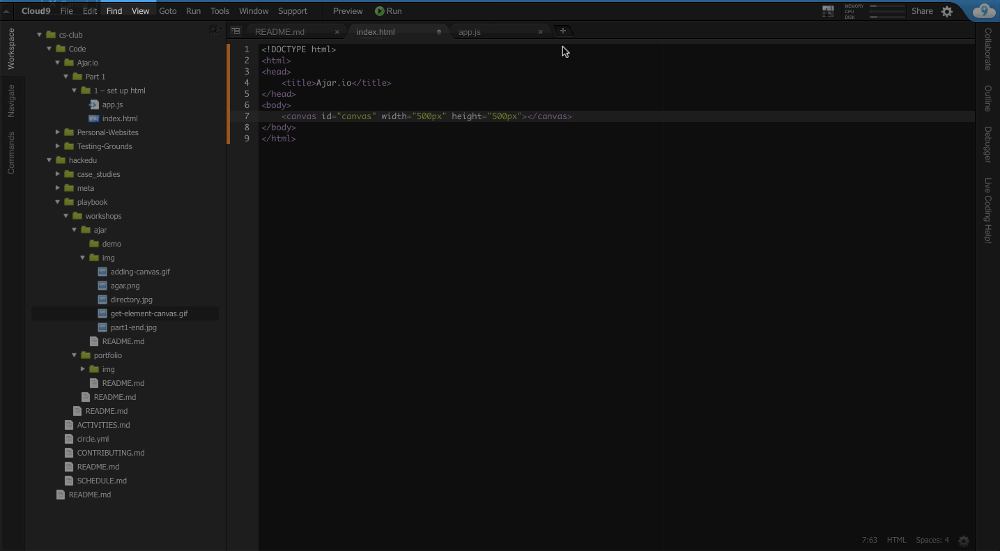
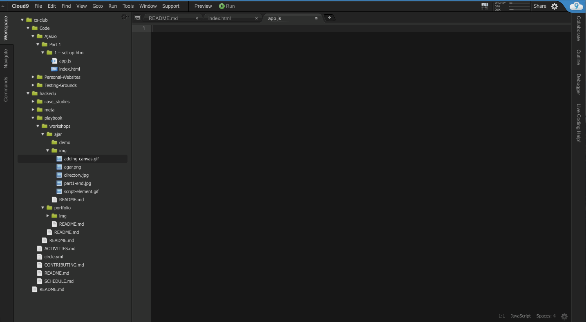
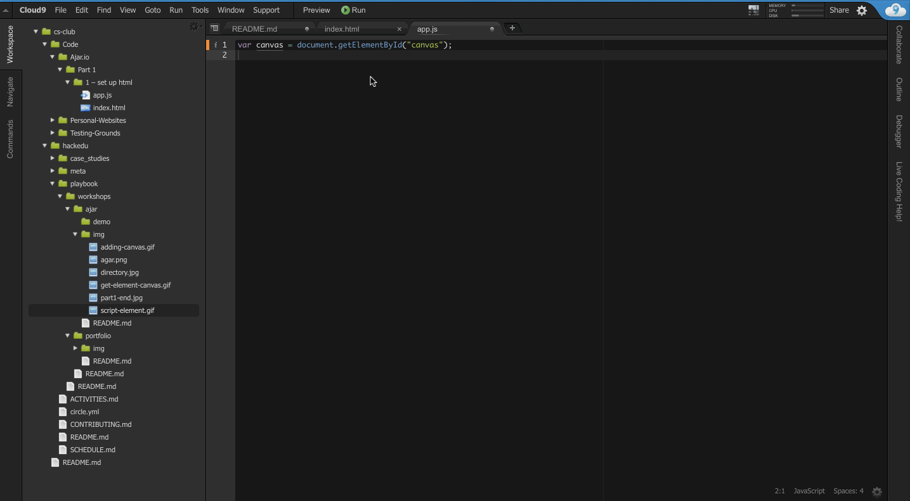
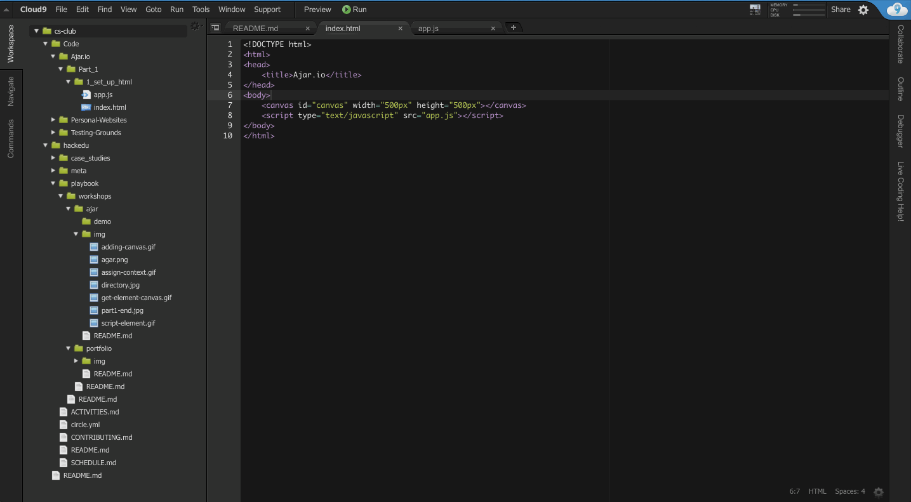
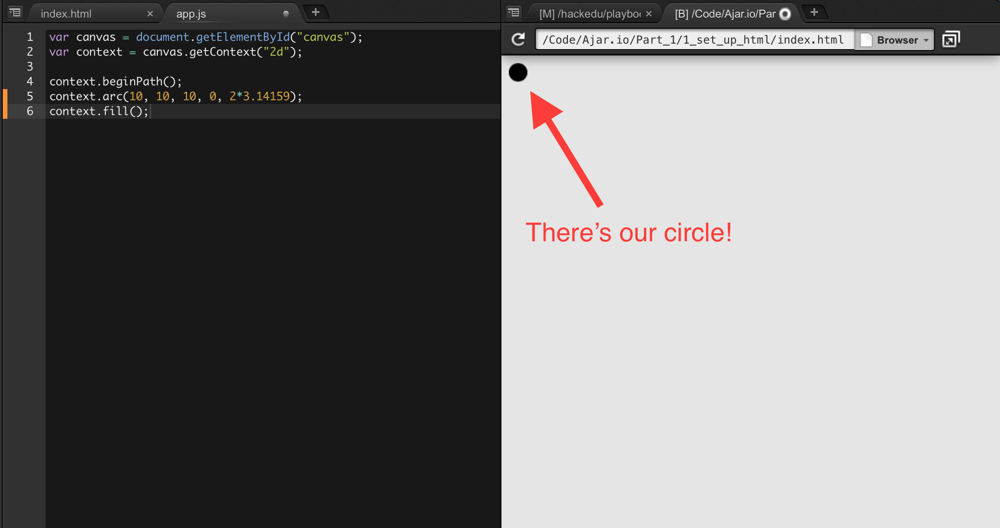
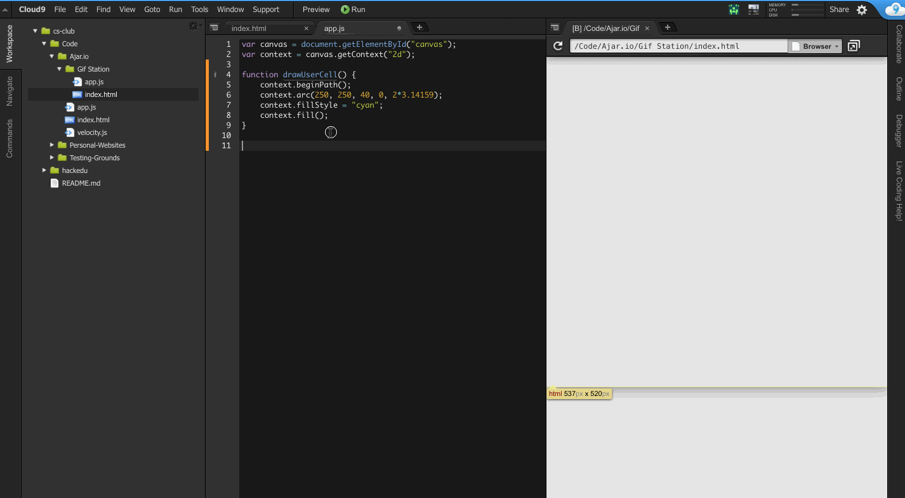

# Ajar.io

-------------------------------------------------------------------------------

[Agar.io](http://agar.io) is a popular game built for the web with
[HTML, CSS, and Javascript](http://qr.ae/RoCXc7). The goal of this workshop is
to teach you to make your own simplistic version of agar.io which we'll call
ajar.io.


The workshop will be divided into several parts (check indicates workshop has
been written):

- [x] [__Part 1__](#part-1) – display the user's cell on screen.
- [x] [__Part 2__](#part-2) – convert the code from part 1 to use functions.
- [ ] __Part 3__ – make the user's cell follow the mouse cursor.
- [ ] __Part 4__ – add acceleration & velocity to the cell's movements.
- [ ] __Part 5__ – add randomly generated food.

__More coming soon...__

## Part 1

In this part you're going to learn to display the user's cell on-screen using
the [HTML `<canvas>` element](http://www.w3schools.com/html/html5_canvas.asp).

> The HTML `<canvas>` element is used to draw graphics, on the fly, via
> scripting (usually JavaScript).

> The `<canvas>` element is only a container for graphics. You must use a script
> to actually draw the graphics.

> Canvas has several methods for drawing paths, boxes, circles, text, and adding
> images.

> *--- from [W3C](http://www.w3schools.com/html/html5_canvas.asp)*

My the end of this part you'll have something that looks like this:


Check out the demo [here](http://jsbin.com/jizoyo/edit?output)
([JS Fiddle](http://jsfiddle.net/4j6od7hv/)).

### Creating the files

In Cloud9, create two files in a folder of your choice:

- index.html
- app.js

Your folder should look like this:


### Setting up the HTML

Type the below code as it is written *exactly* into your `index.html` file in
Cloud9 (no copy-pasting :p):

```
<!DOCTYPE html>
<html>
<head>
	<title>Ajar.io</title>
</head>
<body>
</body>
</html>
```

Next, add the below `<canvas>` element inside of the `<body>` element.

```
<canvas id="canvas" width="500px" height="500px"></canvas>
```


> #### Understanding the code

> `canvas` – the canvas element allows you to draw shapes and other visual
> elements on screen. Feel free to
> [read more about canvas](http://www.w3schools.com/html/html5_canvas.asp).

> `id` – to review, this *attribute*, which can be applied to any HTML element,
> allows you to use that element in your javascript.

> `width` – specifies the width of the `<canvas>`, this time in pixels.

>  `height` – specifies the height of the `<canvas>`, this time in pixels.

-------------------------------------------------------------------------------

Now we have to tell our HTML (`index.html`) to use our Javascript (`app.js`). In
our `index.html` file we add the following line inside of the the `<body>`
element (make sure it's at the end):

```
<script type="text/javascript" src="app.js"></script>
```



Your HTML is now configured!

### Writing the Javascript

The bulk of this workshop will take place in our the `app.js` file. If you
completed the previous section successfully, your `app.js` file should be linked
to your HTML (`index.html`).

Let's start by writing this line:

```
var canvas = document.getElementById("canvas");
```



> #### Understanding the code

> `var` – creates a variable named `canvas`. Variables are containers for
> storing data values. In this case `canvas` is used to reference the `<canvas>`
> element from your HTML.

> `document.getElementById("canvas")` – this function gets an element from your
> HTML that has the id you provide inside the quotes, in this case "canvas".
> Feel free to
> [read more about functions](http://www.w3schools.com/js/js_functions.asp).

> The `<canvas>` element retreived by `document.getElementById("canvas")` gets
> *assigned* to the variable `canvas`.

Next, write this line of code:

```
var context = canvas.getContext("2d");
```



> #### Understanding the code

> You create another variable, this time named `context`. Don't worry too much
> about *what* `context` is, just know that we will be using it to draw shapes
> on the canvas.

Time to draw a circle! Open your `index.html` file and from the menu bar click
`Preview > Live Preview File (index.html)`.



Now each time you save changes to your HTML or Javascript your site will refresh
to reflect the changes. Remember to *save* changes by going to `File > Save`.

Write the following lines at the end of your `app.js` file:

```
context.beginPath();
context.arc(10, 10, 10, 0, 2*3.14159);
context.fill();
```

You should have something that looks like this.



> #### Understanding the code

> `context.beginPath()` – any shape on the canvas is considered a path. You need
> to call this function before begining to draw a new shape. In this case we are
> starting to draw a circle.

> `context.arc(10, 10, 10, 0, 2*3.14159)` – this function creates an arc. An arc
> that ends where it starts forms a circle. The function takes a lot of
> *arguments* (the items separated by commas) so let's look at each one. The
> order of the arguments goes as follows: `x, y, radius, startAngle, endAngle`.

> - The `x` and `y` (both 10 in this case) indicate where to position the center
>   of the arc. The top left corner of the canvas is considered (0, 0). Try
>   moving the circle to a different location by changing the `x` and `y`.

> - The `radius` (also 10) determines the radius of the arc. Try making the
>   circle a little larger by changing the `radius`.

> - The `startAngle` (0) determines at what angle the arc should start. The
>   angle is measured in
>   [radians](https://www.mathsisfun.com/geometry/radians.html). Briefly, 0
>   radians = 0 degrees and 2π radians = 360 degrees.

> - The `endAngle` (2*π) determins at what angle the arc should end. If the
>   `endAngle` is 2π radians, or 360 degrees, more than the `startAngle`, the
>   arc loops back into itself and forms a circle. Try making a semi-circle by
>   changing the `endAngle`.

> `context.fill()` fills the shape with a solid color. In this case the color is
> black.

Let's add some color! For this we write the following line directly above the
`context.fill` function:

```
context.fillStyle = "cyan";
```


Woah! Our circle is now cyan.

> #### Understanding the code

> The fillStyle is a variable that deterimines the color that is used to fill
> the shape. [Many colors](http://www.w3schools.com/cssref/css_colornames.asp)
> are available, so try some on your own (like papayawhip).

When you've finished exploring, change the arguments of the `context.arc`
function to the following:

- `x`: 250
- `y`: 250
- `radius`: 40
- `startAngle`: 0
- `endAngle`: 2*3.14159

Your website should now look like this:


#### Congrats!

You've finished Part 1!


## Part 2

Welcome to part 2 of the Ajar.io workshop!

To recap, in [part 1](#part-1) you learned about:

- **JavaScript variables**: used to store data values. Declared using the `var`
  keyword.
- **Drawing on the canvas**: the HTML `<canvas>` element is used to draw
  graphics, on the fly, via scripting (usually JavaScript). You obtain the 
  drawing context of the `<canvas>` element by calling the _function_ (more on
  what that means today) `getContext("2d")` of the `<canvas>` element. You use
  the drawing context to draw shapes on the canvas.

In this part you will learn about **functions**.

### What are functions?

In part 1, you wrote all your code outside of any functions. This means that
your code runs from *top to bottom*. This was okay for a simple task such as
displaying one circle on screen. For more complex scenarios we will need 
**functions**.

**A JavaScript function is a block of code designed to perform a particular
task.**

A function looks like this:

```
function name() {
    // code to be executed goes here <-- that is a comment
}
```

A JavaScript function is defined with the `function` keyword, followed by a name,
followed by parentheses `()`. The code to be executed by the function is
placed inside curly brackets: `{}`.

You "run" a function (the code inside of it) by "invoking" the function.

You use the `()` operator invokes the function. To invoke the function `name`
from above, you would write the code:

```
name();
```

The code contained within the curly brackets `{}` would then be executed.

Unlike the code in part 1, **code contained in functions can be run multiple
times**.

Let's make another function.

```
function addOne(myNumber) {
    myNumber = myNumber + 1;
}
```

This function's name is `addOne`.

But look! There's something inside of the parentheses. You can put
**parameters** inside function parentheses. Parameters are values you can give 
to the function that the function can then use when executing it's code block.

In this function we give the function a number. The function can refer to this
number as `myNumber`.

The function proceeds to take the number (`myNumber`) and add one to it.

So how do we "invoke" this function? Like this:

```
addOne(5);
```

The function thinks of `myNumber` as a variable whose value is `5`. It then
proceeds to run the code:

```
myNumber = myNumber +1;
```

Because `myNumber` is 5, you can think of the computer seeing the code like
this:

```
myNumber = 5 + 1;
```

So `myNumber` becomes `6`.

### Using functions in Ajar.

Right now your code should look like this:
> `Index.html`
> ```
<!DOCTYPE html>
<html>
<head>
	<title>Ajar.io</title>
</head>
<body>
    <canvas id="canvas" width="500px" height="500px"></canvas>
    <script type="text/javascript" src="app.js"></script>
</body>
</html>
```

> `App.js
> ```
var canvas = document.getElementById("canvas");
var context = canvas.getContext("2d");
context.beginPath();
context.arc(x, y, 40, 0, 2*3.14159);
context.fillStyle = "cyan";
context.fill();
```

Let's modify our code to use functions. Go ahead and open your `index.html`
file and click on _preview_ in the menu bar and then _Live Preview File
(index.html)_. Now open your `app.js` file.

The first thing we want to do is to wrap these lines in a function:

```
context.beginPath();
context.arc(250, 250, 40, 0, 2*3.14159);
context.fillStyle = "cyan";
context.fill();
```

We're going to make a new function called `drawUserCell` and place the lines
from above in it:

```
function drawUserCell() {
    context.beginPath();
    context.arc(250, 250, 40, 0, 2*3.14159);
    context.fillStyle = "cyan";
    context.fill();
}
```


If you save the file now you'll see that there's no more circle on screen!

This is because we haven't "invoked" the function `drawUserCell`. Let's invoke
it. Type out the code below the `drawUserCell` function:

```
drawUserCell();
```



The circle is back!

#### Congrats!

You've finished Part 1!


# More coming soon...