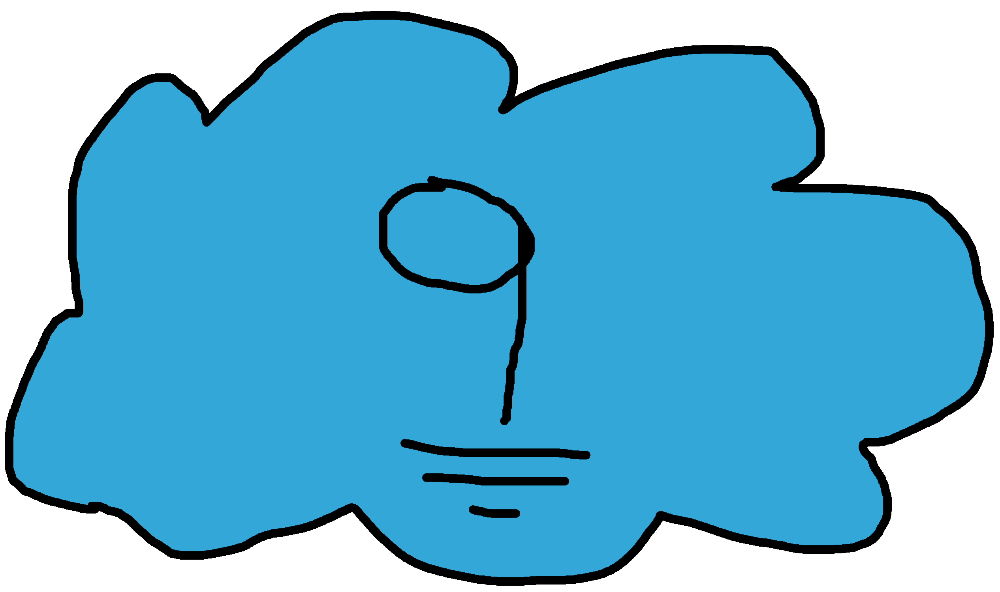

# Recap  – *Monday, September 21st, 2015*

> *Dear reader*, these recaps were initially requested by [hackedu](https://hackedu.us/) for other club organizers to read. However if you're a club member you can use them to find out what happened at a meeting you couldn't attend, if you just want to review some content, or for any reason you want!

Another successful meeting for the Cherry Hill Computer Science Club! Had around 30 people attend, with 3 or 4 new members, even though there were no "late busses" (second round of busses at 4pm). Our meeting last 1.5 hours.

The club officers met during the weekend to talk about the club and create content. We made:

- [Google Slide presentation](https://drive.google.com/open?id=12EV5p5hZW1vRDzhjUGbSsconuaTV2mTil9-1FlEoPn8) – feel free to make a copy and customize!

- [Intro to Cloud9 workshop](https://github.com/CHE-CS/hackedu/tree/master/playbook/workshops/cloud9) – also introduces how to use import CSS and Javascript files into HTML (`<link>` and `<script>` elements).

- [Ajar.io Part 1 workshop](https://github.com/CHE-CS/hackedu/tree/master/playbook/workshops/ajar) –  huge success. Introduces `<canvas>` element and finishes with having a dot drawn on screen.

---

## Cloud9 intro

We decided it was time to transition away from JSBin because 1) it was being randomly blocked by Baraccuda Networks (our schools firewall) and 2) we think it's time to expand our member's understanding web development (setting up and linking the files yourself).

See the workshop [here](https://github.com/CHE-CS/hackedu/tree/master/playbook/workshops/cloud9). Feel free to add to it, I will add a troubleshooting section there instead of hiding it in this recap.

The workshop took around 40 minutes to complete, slightly longer than I had hoped. Yet it was *ok*. If people finish early (some did), encourage them to add their own styles to the button or to change the alert text. Possibly point them to the [list of CSS colors](http://www.w3schools.com/cssref/css_colors.asp).

## Ajar.io part 1

Ajar.io is a series of workshops (developed by @bogidon @Salamander1012 and @Jonwlee) to teach students how to make a clone of the online game [agar.io](http://agar.io). 

This workshop was thought up because many people in our club were playing agar.io (instead of following the lesson). Ajar drew a lot of interest – in fact for much of the workshop *everyone in the room was on task*. Success!

### Suggestions

If people finish early engage them with more content! 

- Point them to [W3C's page on the `<canvas>` API](http://www.w3schools.com/html/html5_canvas.asp) (this like appears three times by the end of Part 1 of the workshop).

- Explain the `context.arc()` function. The parameters are `x, y, radius, startAngle, endAngle`. Focus on explaining the angles, which are in radians (the `x`, `y` and `radius` are easy to understand). Explain that the `arc` function forms a circle when the `endAngle` is 2π radians (360º). Let them predict what would happen if the `endAngle` is set to π instead of 2π.

- One club member wanted to draw a diamond. I walked her through googling `"how to draw a diamond on canvas with javascript"`. It led us to [this tutorial](http://www.onlywebpro.com/2011/07/02/html5-canvas-for-absolute-beginners-part-2/). Careful with this particular tutorial because 1) the javascript lives in the html as opposed to a separate file like in the tutorial, 2) `context` is abbreviated to `ctx` and 3) there is a function called `drawShape()`.

> ## Personal notes about teaching

> - I'm getting more comfortable teaching: speaking louder, explaining more clearly.
- Better at getting people's attention (turning lights on and off, speaking louder, getting VPs to help gather people's attention).
- Fewer distractions, more focused on answering questions. I was constantly circling the room.