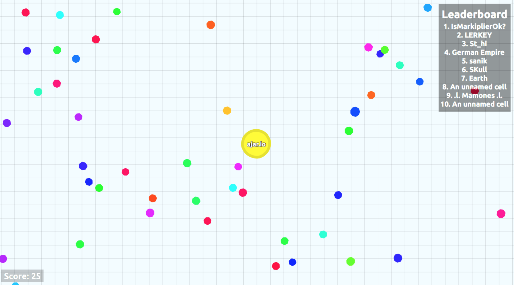
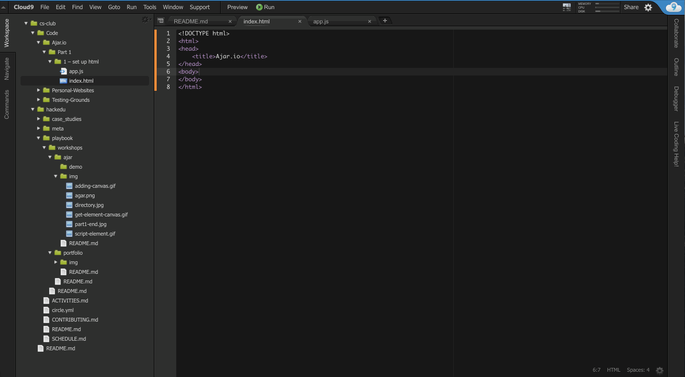

# Ajar.io

---

[Agar.io](http://agar.io) is a popular game built for the web with [HTML, CSS, and Javascript](https://www.quora.com/Difference-between-HTML-XML-PHP-CSS-and-JavaScfdffdript-in-layman-terms). The goal of this workshop is to teach you to make your own simplistic version of agar.io which we'll call ajar.io. 

> 

The workshop will be divided into several parts:

- __Part 1__ – display the user's cell on screen.
- __Part 2__ – convert the code from part 1 to use functions.
- __Part 4__ – make the user's cell follow the mouse cursor.
- __Part 5__ – add randomly generated food.
- __Part 6__ – add acceleration & velocity to the cell's movements. 
- __More coming soon...__

## Part 1

In this part you're going to learn to display the user's cell on-screen using the [HTML `<canvas>` element](http://www.w3schools.com/html/html5_canvas.asp).

> The HTML `<canvas>` element is used to draw graphics, on the fly, via scripting (usually JavaScript).

> The `<canvas>` element is only a container for graphics. You must use a script to actually draw the graphics.

> Canvas has several methods for drawing paths, boxes, circles, text, and adding images.

> *--- from [W3C](http://www.w3schools.com/html/html5_canvas.asp)*

My the end of this part you'll have something that looks like this:


Check out the demo [here](http://jsbin.com/jizoyo/edit?output) ([JS Fiddle](http://jsfiddle.net/4j6od7hv/)).

### Creating the files

In Cloud9, create two files in a folder of your choice:

- index.html
- app.js

Your folder should look like this:


### Setting up the HTML

Type the below code as it is written *exactly* into your `index.html` file in Cloud9:

```
<!DOCTYPE html>
<html>
<head>
	<title>Ajar.io</title>
</head>
<body>
</body>
</html>
```

Next, add the below `<canvas>` element inside of the `<body>` element.

```
<canvas id="canvas" width="500px" height="500px"></canvas>
```



> #### Understanding the code

> `canvas` – the canvas element allows you to draw shapes and other visual elements on screen. Feel free to [read more](http://www.w3schools.com/html/html5_canvas.asp).

> `id` – to review, this *attribute*, which can be applied to any HTML element, allows you to use that element in your javascript.

> `width` – specifies the width of the `<canvas>`, this time in pixels.

>  `height` – specifies the height of the `<canvas>`, this time in pixels.

---

Now we have to tell our HTML (`index.html`) to use our Javascript (`app.js`). In our `index.html` file we add the following line inside of the the `<body>` element (make sure it's at the end):

```
<script type="text/javascript" src="app.js"></script>
```


Your HTML is now configured!

### Writing the Javascript

The bulk of this workshop will take place in our the `app.js` file. If you completed the previous section successfully, your `app.js` file should be linked to your HTML (`index.html`).

Let's start by writing this line:

```
var canvas = document.getElementById("canvas");
```


> #### Understanding the code

> `var` – creates a variable named `canvas`. Variables are containers for storing data values. In this case `canvas` is used to reference the `<canvas>` element from your HTML.

> `document.getElementById("canvas")` – this function gets an element from your HTML that has the id you provide inside the quotes, in this case "canvas".

> The `<canvas>` element retreived by `document.getElementById("canvas")` gets *assigned* to the variable `canvas`.

