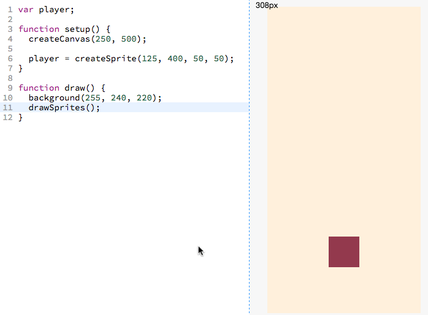
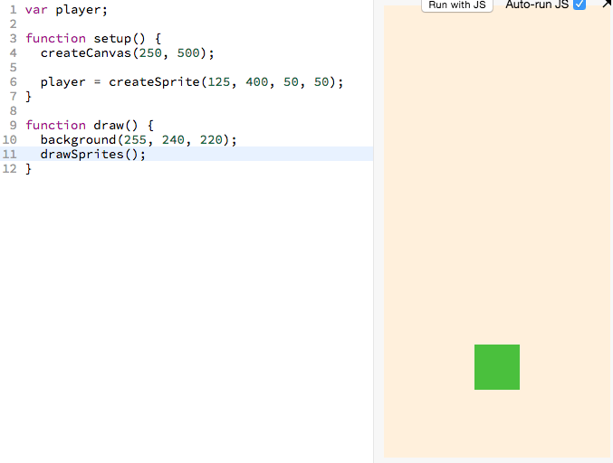
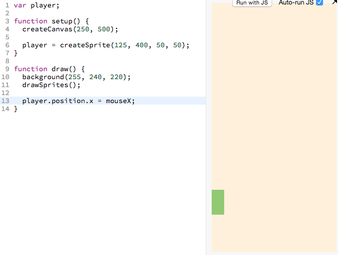
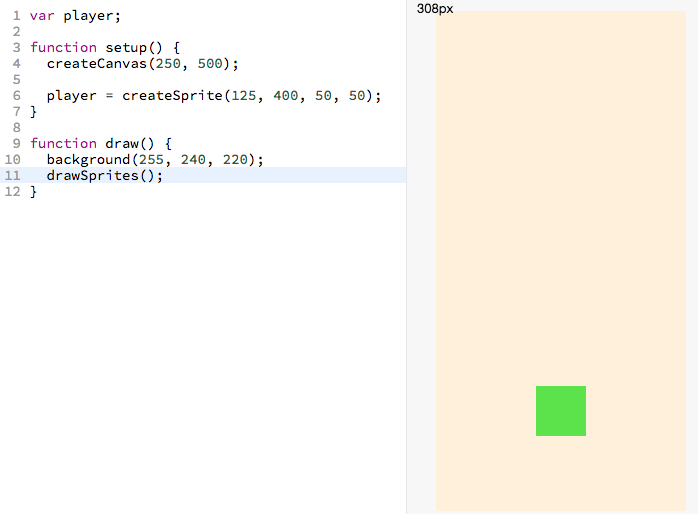
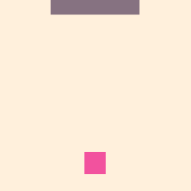

# Step 3: Making the Sprite Follow the Mouse

## Background

| From step 2, we added a sprite <br> that doesn't move yet: <br><br>  | Now we want to make it <br> move like this: <br><br>  |
|-----------------------------------------------------------------------------------------|--------------------------------------------------------------------------|

## Outcome of This Step

After you finish this step, you will learn how to move a sprite to wherever the
mouse is. Here is the code you will end up with (_the new code is highlighted in
gray_):

> 

[][mouse]

## Choose Your Own Path

- [**Walk me through this code step-by-step.**]
  (#walk-through-of-the-code-step-by-step)
    - Recommended for those who
      - Are beginners
      - Who want an in depth understanding of the code
- [**Give me a brief overview of this code.**](#brief-overview-of-the-code)
    - Recommended for those who
      - Have more experience
      - Want to cover more ground but have a less in depth understanding
      - Want to recap what they did in the step-by-step section

# Walk Through of the Code Step-By-Step

## Deciding Where to Write the Code

Whenever we want to set the position of the sprite to be wherever our mouse is.

We don't want to do this just once, we want to do it _forever_. Because we want
to do it forever, let's write it in `draw function`

## Setting the Position of the Sprite

We can set the `x` position of the `player` sprite like this:

```js
player.position.x = 50;
```

You can read the above line as follows:

- Set the **`player`**'s **`x`** **`position`** to be equal to **`50`**.

- [ ] Let's try adding the above code:

> 

## Setting the `x` Position of the Sprite to the `x` location of the mouse

Now instead of setting the `x` position to be `50`, let's set it to the `x`
position of the mouse.

We can do this by writing

```js
player.position.x = mouseX;
```

- [ ] Let's try adding the above code:



## Setting the `y` Position of the Sprite to the `y` location of the mouse

The below code sets the player's `y` position to the `y` location of the mouse.

```js
player.position.y = mouseY;
```

- [ ] Let's try adding the above code:



### And that's a wrap

The section immediately below section is the "Give me a brief overview of this
code". You already did the "Walk me through this code step-by-step" section so
no need to do it.

[Click here to skip to the next section.](#next-up)

# Brief Overview of the Code

Reproduced below is the code that sets the player sprite's position to the
position of the mouse

New lines marked with `// <-- NEW LINE`.

```js
var player;

function setup() {
  createCanvas(250, 500);

  player = createSprite(125, 400, 50, 50);
}

function draw() {
  background(255, 240, 220);
  drawSprites();

  player.position.x = mouseX;  // <-- NEW
  player.position.y = mouseY;  // <-- NEW
}
```

- [ ] Go ahead and add the `NEW LINES` to your code:

> 

[][mouse]

## Understanding New Concepts

We can interpret the following line:

```js
player.position.x = mouseX;  // <-- NEW
```

as "Set the **`player`**'s **`x`** **`position`** to be equal to the x position
of the mouse (**`mouseX`**)"


## Next Up

| **[  <br> 3. Dribble Ball](dribble_ball.md)** |
|------------------------------------------------------------------|

## Steps

| **[ <br> 1. Initial Setup] (initial_setup.md)** | **[ <br> 2. Add Player Sprite]  (add_player_sprite.md)** | **[  <br> 3. Mouse Movement](mouse_movement.md)** |
|--------------------------------------------------------------------|-----------------------------------------------------------------------------|----------------------------------------------------------------------|
| **[ <br> 4. Dribble Ball](dribble_ball.md)**    | **[ <br> 5. Add Goal](add_goal.md)**                     | **[ <br> Back to the README.md](README.md)**      |

[mouse]: https://jsbin.com/gist/c80f8e287b5cc76dcf96
