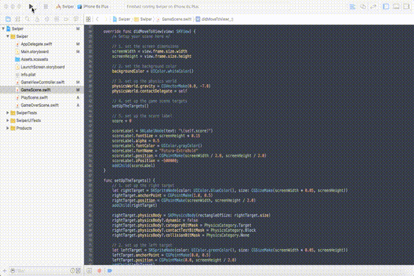

# Create the Score Label

### Set Up the Variables

Here, we will create the score label for the game! We will stay in the
`GameScene.swift` file for this. First we have to make a `SKLabelNode` variable
and a variable of type `Int` meaning it will hold an integer. This code will go
right under the screen dimensions variables we created which are above the
`didMoveToView()` method. You already know how to define the `SKLabelNode` but
the `Int` is a little different. In this line we both define the variable and
set it. In this line we can set the default value of the `score` variable to
`0`.

```swift
// score label
private var scoreLabel: SKLabelNode!
private var score: Int = 0
```

### Create the Label

Now, we can create the label! We have done this before, but there is one
difference here. The value of this label can change. So first we make sure the
`score` variable is set to `0`. Then we create the label. But in the first line,
we set the text by writing `"\(self.score)"`. This means that the label will
display whatever the value of the `score` variable is at the moment, which at
this point is `0`. Also, in this line of code we replace the line which set the
`name` property in the `PlayScene.swift` file to one that sets the `zPosition`
property which just sets where, on the z-axis, the label is placed on screen.
Setting it to `-500000` makes sure it is below all other nodes on the screen.

```swift
// 5. set up the score label
score = 0

scoreLabel = SKLabelNode(text: "\(self.score)")
scoreLabel.fontSize = screenHeight * 0.15
scoreLabel.alpha = 0.5
scoreLabel.fontColor = UIColor.grayColor()
scoreLabel.fontName = "Futura-ExtraBold"
scoreLabel.position = CGPointMake(screenWidth / 2.0, screenHeight / 2.0)
scoreLabel.zPosition = -500000;
addChild(scoreLabel)
```

### Run the Project

Finally, let's run the project to see what we just did!

 

### Recap

You learned how to:

- Create a `Int` variable with a default value
- Create a `SKLabelNode` with a changing text value
- Set the `zPosition` on a node

--------------------------------------------------------------------------------

This part was short and sweet! You are ready to continue on to Part 5 in which
you set up the box spawning in the `GameScene.swift` file!
