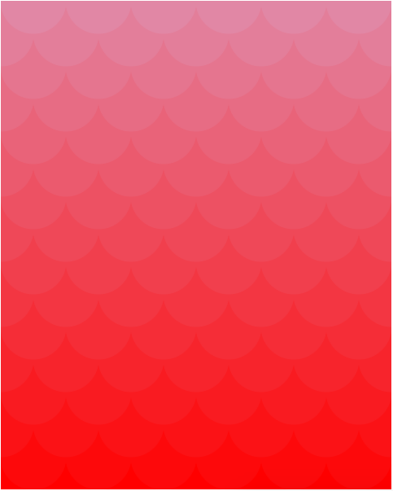
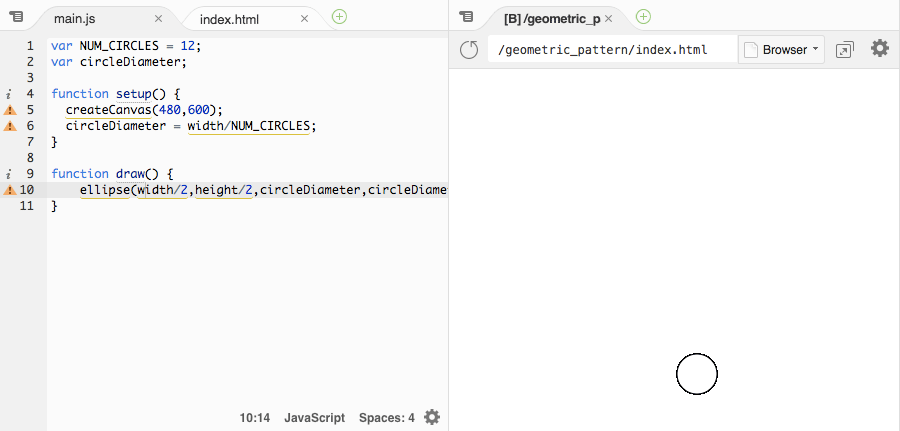
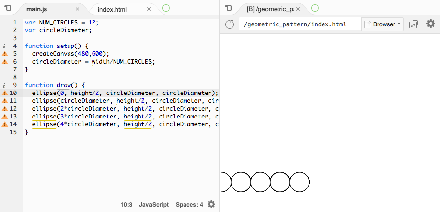
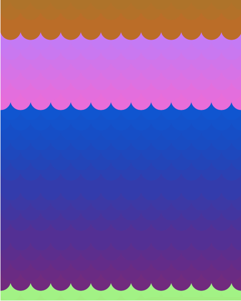
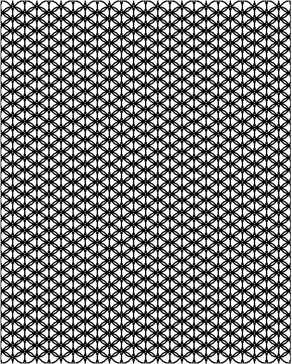
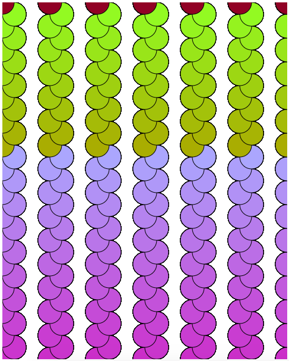
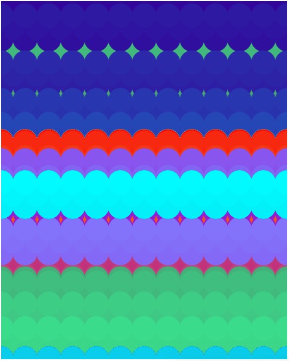

# Geometric Pattern

| What you'll build    |
| -------------------- |
|  |

Here's a link to the [live demo][live_demo] and the [final code][final_code]. This workshop should take around 1 hour.

_**Warning: the following demo involves flashing colors and is not recommended for those with a history of epilepsy.**_ There's also an [animated demo][animated_live_demo].

_**We recommend going through this workshop in Google Chrome.**_

[live_demo]: https://prophetorpheus.github.io/geometric_pattern
[animated_live_demo]: https://prophetorpheus.github.io/geometric_pattern/version2.html
[final_code]: https://github.com/prophetorpheus/prophetorpheus.github.io/tree/master/geometric_pattern

---

We'll be creating a cool graphic like the one above, using JavaScript and p5.js. [p5.js](http://p5js.org/) is a library for making stuff in conjunction with the [HTML canvas element](https://developer.mozilla.org/en-US/docs/Web/HTML/Element/canvas). p5.js is nothing more than JavaScript code written to make commonly-desired functionality much more accessible. It is primarily used to make visuals and graphics for games and websites.

**Table of Contents:**

- [Part I: Set-up](#part-i-set-up)
- [Part II: Priming the Files](#part-ii-priming-the-files)
- [Part III: Drawing on the Canvas](#part-iii-drawing-on-the-canvas)
- [Part IV: Adding Color](#part-iv-adding-color)
- [Part V: Publishing and Sharing](#part-v-publishing-and-sharing)
- [Part VI: Animate It](#part-vi-animate-it)
- [Part VII: Hacking](#part-vii-hacking)

## Part I: Set-up

First, go to Cloud9 and open up your `projects` workspace by pressing Open.


Once in the workspace, right-click the `projects` folder on the left and select `New Folder`. Name it `geometric_pattern`.

Next, right-click the `geometric_pattern` folder, select `New File`, and name it `index.html`.
Then, right-click the `geometric_pattern` folder again, select `New File` again, and this time, name it `main.js`.

## Part II: Priming the Files

### Priming the HTML File

Double-click `index.html` to open it. Just as we've done previously, we'll type this base structure into our HTML file:

```html
<!DOCTYPE html>
<html>
  <head>
  </head>
  <body>
  </body>
</html>
```

Now, let's add our JavaScript dependencies, namely, p5.js. Let's add that into our **body** with a `<script>` tag: **Please type everything except the URL, which you can copy and paste!**

```html
<body>
  <script src="https://cdnjs.cloudflare.com/ajax/libs/p5.js/0.4.12/p5.js"></script>
</body>
```

We'll also need to attach our JavaScript file, `main.js`. Add this below the line that adds p5.js:

```html
<body>
  <script src="https://cdnjs.cloudflare.com/ajax/libs/p5.js/0.4.12/p5.js"></script>
  <script src="main.js"></script>
</body>
```

Now we'll save (with shortcut: <kbd>CTRL+s</kbd> / <kbd>Cmd+s</kbd>) and open Live Preview (`Preview` > `Live Preview`).

### Priming the JS File

Double-click `main.js` to open, and type the following:

```js
function setup() {
}

function draw() {
}
```

p5.js works by automatically calling two special functions: [`setup()`](http://p5js.org/reference/#/p5/setup) and [`draw()`](http://p5js.org/reference/#p5/draw) to create the visuals on your webpage. We'll be writing our own code in these functions, so that p5.js can then run our code.

`setup()` is run only once, at the beginning. `draw()` on the other hand, is run repeatedly after `setup()` finishes, and in this way, provides the basis for any animation or interaction you see in your project.

Let's save and refresh Live Preview.

It looks like nothing, because our functions do nothing. Let's add something for `setup()` to set up.

```js
function setup() {
  createCanvas(480, 600);
}
```

[`createCanvas()`](http://p5js.org/reference/#p5/createCanvas) is a function that takes two arguments (two numbers for width and height, respectively) and creates an [HTML canvas element](https://developer.mozilla.org/en-US/docs/Web/HTML/Element/canvas) (i.e., where your pattern will be contained) of that size.

In this project, we'll be creating a tiling of overlapping circles.

First, let's decide how many circles we want in each row. We can store this number in a variable **at the top, above both functions**:

```js
var NUM_CIRCLES = 12;

function setup() {
  createCanvas(480, 600);
}

function draw() {
}
```

We'll use this to determine the diameter of the circles we want to draw, by doing some simple math. Let's declare a variable to store the value of the circle diameter; name it `circleDiameter`. Add the declaration at the top of the file, underneath `NUM_CIRCLES`, and define it within `setup()`:

```js
var NUM_CIRCLES = 12;
var circleDiameter;

function setup() {
  createCanvas(480, 600);
  circleDiameter = width/NUM_CIRCLES;
}

function draw() {
}
```

p5.js stores the width of the canvas in a variable named [`width`](http://p5js.org/reference/#/p5/width). By dividing the width by the number of circles, we can calculate the length of the diameter, which we'll store in `circleDiameter`.

## Part III: Drawing on the Canvas

### Drawing One Circle

p5.js makes drawing ellipses and circles easy with the function [`ellipse()`](http://p5js.org/reference/#p5/ellipse).

Let's see the `ellipse()` function in action by drawing a circle in the middle of the screen:

```js
function draw() {
  ellipse(width/2,height/2,circleDiameter,circleDiameter);
}
```

Save and refresh Live Preview. It might also be helpful to open up the external preview:



In this example, the first two arguments we pass to the ellipse function are the x and y coordinates of the center of the ellipse. We've passed in `width/2` and `height/2`, respectively, which means the center of the ellipse will also be the center of the canvas. The latter two arguments are the x-width and y-width of the ellipse. Since we want to draw a circle, we're passing the same value for both.

You can play around with these values to get a better feel of how this function works.

### Drawing a Row of Circles

Let's try to draw a row of circles first. We'll want to place them `circleDiameter` away from each other. Modify your `draw()` function so it looks like this. Notice how we have to change the first argument (the x-coordinate) in each line.

```js
function draw() {
  ellipse(0, height/2, circleDiameter, circleDiameter);
  ellipse(circleDiameter, height/2, circleDiameter, circleDiameter);
  ellipse(2*circleDiameter, height/2, circleDiameter, circleDiameter);
  ellipse(3*circleDiameter, height/2, circleDiameter, circleDiameter);
  ellipse(4*circleDiameter, height/2, circleDiameter, circleDiameter);
}
```



So here we've drawn 4.5 circles. Why is there a half-circle? Check out the documentation for [`ellipse()`](http://p5js.org/reference/#p5/ellipse) and see if you can figure it out.

Anyway, we can draw 7.5 more, since we've made room for 12 (when we set `NUM_CIRCLES`). Keep going until it looks like this:


Great, now that we've drawn one row of circles in the middle, we have to draw the other rows. Guess we'll be writing a lot of `ellipse()` statements.

Just kidding! There's a construct in programming called a loop, and it repeats a set of instructions as many times as you decide.

_**Here's a quick [example loop](./loops.md).**_

Let's remove all those repetitive lines and add a loop into our `draw()` function. We'll be using a type of loop called a **while-loop**, like so:

```js
function draw() {
  var x = 0;
  while (x <= width) {

    x = x + circleDiameter;
  }
}
```

You'll notice there are multiple parts to this:

- `var x = 0;`: this is a variable that will store the value of our x-coordinate as we draw ellipses across the row.
- `while (x <= width)`: this is the header of the while-loop, and it means that the instructions within the loop should be executed as long as `x` is less than or equal to `width`.
- `{` and the corresponding `}` at the bottom: these braces enclose the code that should be repeated.
- `x = x + circleDiameter;`: this is one instruction we want to be repeated. This will alter the value of `x`, incrementing it by `circleDiameter` every time we go through the loop.

If we save and refresh, we'll see nothing. That's because there is no code inside the while-loop that affects the canvas. Let's add a line to draw an ellipse at the top of the canvas:

```js
function draw() {
  var x = 0;
  while (x <= width) {
    ellipse(x, 0, circleDiameter, circleDiameter);
    x = x + circleDiameter;
  }
}
```

We're supplying `x` as the x-coordinate (cleverly named, eh?), and 0 as the y-coordinate, of the ellipse's center.

If you save and refresh, you'll see a line of cut-off circles at the top. Since the value of `x` is increased by `circleDiameter` after every iteration of the while-loop, circles are drawn in intervals of `circleDiameter` pixels, just like how you changed the x-coordinate argument in `ellipse()` when you were manually creating each circle. This is the magic of the while-loop.

As to why the circles are cut off -- this is because we set the y-coordinate of the _center_ of every circle to 0.

**Remark: if your page is frozen, refresh the page and check your while-loop code. Chances are you've got an [infinite loop](https://en.wikipedia.org/wiki/Infinite_loop).**

### Drawing a Grid of Circles

So that's great, we've drawn one row of circles. But what we'd like is to cover the entire canvas with circles.

Just like we used a loop to repeat circles in the horizontal direction, we can also use another loop to repeat them in the vertical direction.

If we wrap our existing while-loop in another while-loop, we'll be performing the action of filling an entire row with circles, multiple times. And thus covering multiple rows.

Let's put everything so far inside another while-loop. Don't forget to update `ellipse()`:

```js
function draw() {
  var y = 0;
  while (y <= height) {

    var x = 0;
    while (x <= width) {
      ellipse(x, y, circleDiameter, circleDiameter);
      x = x + circleDiameter;
    }

    y = y + circleDiameter;
  }
}
```

As with the previous while-loop's `x`, we're executing the code inside the `{` and `}` as long as the value of `y`, which we've initialized at `0`, is less than or equal to `height`. (`height`, as you may have guessed, is the counterpart to `width`, and it is where p5.js stores the height of the canvas.) We're also incrementing `y` at the end of each iteration by `circleDiameter`.

Using this incrementing `y` variable as our y-coordinate is how we're able to draw rows up and down the canvas.

Save and refresh Live Preview to check it out!

Now that we've done some work, let's back it up by committing. This will make sure we have a record of everything we've done in case part of our code gets deleted or lost. Make sure all of your files are saved. Then, head on over to the terminal in Cloud9 by pressing <kbd>alt+t</kbd> and type the following commands (pressing <kbd>enter</kbd> after each one):

- `git add --all`
- `git commit -m "Add geometric_pattern project"`
- `git push`

Then, enter your GitHub username and password (careful here, as password will not be displayed).

### Offsetting the Circles in the Y-Direction

We want the circles to overlap, so let's change the spacing in the y-direction.

We can achieve this by changing the last line of the `y` while-loop to increment by `circleDiameter/2` instead of `circleDiameter`.

We'll create a variable (call it `circleRadius`) for this, at the top of the file, define it in `setup()`, and make the replacement in the last line of the `y` while-loop:

```js
var NUM_CIRCLES = 12;
var circleDiameter;
var circleRadius;

function setup() {
  createCanvas(480, 600);
  circleDiameter = width/NUM_CIRCLES;
  circleRadius = circleDiameter/2;
}

function draw() {
  var y = 0;
  while (y <= height) {

    var x = 0;
    while (x <= width) {
      ellipse(x, y, circleDiameter, circleDiameter);
      x = x + circleDiameter;
    }

    y = y + circleRadius;
  }
}
```

Save and refresh Live Preview to see the change.

### Offsetting the Circles in the X-Direction

It looks pretty cool right now, but our circles aren't overlapping exactly right. It looks like every other row should be shifted horizontally by `circleRadius`.

We can keep track of shifted rows by using a flag. A flag is just a variable that stores a `true`/`false` value.

Let's add one in our `draw()` function:

```js
function draw() {
  var isShifted = false;

  var y = 0;
  while (y <= height) {

    var x = 0;
    while (x <= width) {
      ellipse(x, y, circleDiameter, circleDiameter);
      x = x + circleDiameter;
    }

    y = y + circleRadius;
  }
}
```

To differentiate between rows, we should add a line to flip the flag at the bottom of the `y` while-loop, underneath the line that flips `isShifted`. This is because each pass through the `y` while-loop creates a new row, thus it would be appropriate after the creation of each row to flip the flag.

We'll using the negation operator (`!`) to flip from `false` to `true` and vice versa:

```js
function draw() {
  var isShifted = false;

  var y = 0;
  while (y <= height) {

    var x = 0;
    while (x <= width) {
      ellipse(x, y, circleDiameter, circleDiameter);
      x = x + circleDiameter;
    }

    y = y + circleRadius;
    isShifted = !isShifted;
  }
}
```

This sets the flag `isShifted` to its opposite. Its initial value was `false`, and after one row, its value will be `true`. Thus, the second row will be an shifted row. After the second row is created, the flag will be flipped back to false, and so on.

Let's create a conditional that will use the flag's value to determine whether or not to shift the row. We'll add this just after we define `x`, inside the `y` while-loop:

```js
function draw() {
  var isShifted = false;

  var y = 0;
  while (y <= height) {

    var x = 0;

    if (isShifted) {

    } else {

    }

    while (x <= width) {
      ellipse(x, y, circleDiameter, circleDiameter);
      x = x + circleDiameter;
    }

    y = y + circleRadius;
    isShifted = !isShifted;
  }
}
```

Now we just need to make this shift. We'll do this by modifying the starting `x` value. Currently, the starting `x` value is always 0, which results in every row starting at the x-coordinate 0.

We can modify this by removing this definition:

```js
̶v̶a̶r̶ ̶x̶ ̶=̶ ̶0̶;̶
var x;
```

And setting the value _conditionally_:

```js

  while (y <= height) {
    var x;

    if (isShifted) {
      x = circleRadius;
    } else {
      x = 0;
    }

    while (x <= width) {

```

Your `draw()` should now look like this:

```js
function draw() {
  var isShifted = false;

  var y = 0;
  while (y <= height) {

    var x;

    if (isShifted) {
      x = circleRadius;
    } else {
      x = 0;
    }

    while (x <= width) {
      ellipse(x, y, circleDiameter, circleDiameter);
      x = x + circleDiameter;
    }

    y = y + circleRadius;
    isShifted = !isShifted;
  }
}
```

Save and check it out!

Because we've done another chunk of coded, let's back it up:

- `git add --all`
- `git commit -m "Offset circles in geometric_pattern"`
- `git push`

### Reversing Direction

So you may have noticed that it seems that our circles are overlapping on the wrong side. We wanted them to overlap each other on the top, but they are overlapping on the bottom. This is because they are being drawn from top to bottom, and the upper circles are being drawn over.

We can fix this by setting the initial value of `y` to the height, and changing the condition in the while-loop to check if `y` is greater than 0. We'll also decrement the value of `y` instead of incrementing it, at the bottom of the `y` while-loop;

```js
function draw() {
  var isShifted = false;

  var y = height;
  while (y >= 0) {

    var x;

    if (isShifted) {
      x = circleRadius;
    } else {
      x = 0;
    }

    while (x <= width) {
      ellipse(x, y, circleDiameter, circleDiameter);
      x = x + circleDiameter;
    }

    y = y - circleRadius;
    isShifted = !isShifted;
  }
}
```

If your page has frozen, you've probably introduced an infinite loop. Refresh your Cloud 9 workspace and check your code!

Save to see the changes!

Now that we've done more work, let's commit again:

- `git add --all`
- `git commit -m "Reverse direction of circles in geometric_pattern"`
- `git push`

## Part IV: Adding Color

Black and white is nice, but how about some color? We've previously used CSS to change colors, but this is a special case -- CSS can't modify anything inside of a canvas (the container all our p5 stuff shows up in).

p5.js provides several helpful functions, including: [`color()`](http://p5js.org/reference/#p5/color), [`fill()`](http://p5js.org/reference/#p5/fill), and [`stroke()`](http://p5js.org/reference/#p5/stroke) that help modify graphics inside a canvas.

### Changing Fill

One way to use `color()` is to provide 3 arguments; each corresponding to [red (R), green (G), and blue (B) values](https://en.wikipedia.org/wiki/RGB_color_model).

Let's choose our color to be red. The R, G, and B values for a bright red are 255, 0, and 0, respectively. We can create this color with `color(255, 0, 0)`.

Now we'll pass this color to the `fill()` function. If we do this before drawing the ellipse, all the ellipses we draw will be filled with that color. Let's give this a try and type the following line immediately before calling the `ellipse()` function in `draw()`:

```js
fill(color(255, 0, 0));
```

Save and refresh. Your canvas should now look like red dragon scales.

### Changing Stroke

Just like how there's a `fill()` for changing the fill color, there's a `stroke()` for changing the stroke color. Right now, the stroke is black (hence the black outlines).

We can make a garish display by adding a bright green stroke, if we place the following line beneath our `fill()` function call:

```js
stroke(color(0, 255, 0));
```

Save and refresh, and let your eyes be assaulted by this faux pas.

### Changing Color between Rows

While this looks pretty cool, let's make the rows different colors. We can get the gradient effect by setting a starting color, and incrementing the R, G, and B values each time we go through the for loop.

Let's do this by first declaring variables to store each of the R, G, and B values at the top of the file:

```js
var NUM_CIRCLES = 12;
var circleDiameter;
var circleRadius;
var rVal;
var gVal;
var bVal;
```

Next, we'll set their initial values at the top of the `draw()` function:

```js
function draw() {
  rVal = 255;
  gVal = 0;
  bVal = 0;

  var isShifted = false;

  // ...the rest of the draw function
}
```

And then increment the values at the bottom of the `y` while-loop in `draw()`, by adding these lines.

```js
    y = y - circleRadius;
    isShifted = !isShifted;

    rVal = rVal - 2;
    gVal = gVal + 7;
    bVal = bVal + 3;
  }
}
```

Here, we're decrementing the R value by 2, incrementing the G value by 7, and the B value by 3.

You can also try adding those three lines within the x while-loop, which will modify the colors within each row.

Finally, we'll replace the arguments in `color()` with these variables, in both the `fill()` and `stroke()` function calls:

```js
fill(color(rVal,gVal,bVal));
stroke(color(rVal,gVal,bVal));
```

Now, save and see the gradient effect you've applied throughout the pattern! Yay!

We've got another feature done, so let's commit again:

- `git add --all`
- `git commit -m "Add colors to geometric_pattern."`
- `git push`

## Part V: Publishing and Sharing

### Downloading Your Masterpiece

You can actually download the this cool pattern to your computer, to use as a desktop background or what have you. p5.js provides a function [`saveCanvas()`](https://p5js.org/reference/#p5/saveCanvas) to download the canvas.

We can attach this function to a key press by using p5's `keyPressed` function. Add this at the bottom of your `main.js`:

```js
function keyPressed() {
  if (keyCode === 115 || keyCode === 83) {
    saveCanvas('geometricPattern', 'png');
  }
  return false;
}
```

This code says that if the user presses a key with the `keyCode` 115 or 83 (which both correspond to "s"), `saveCanvas()` should be called and the file should be saved as `geometricPattern.png`.

The `return false;` at the end of the function tells the browser to ignore any default behavior that might be associated with the pressed key (ex. if you press enter, the browser thinks that you're trying to submit a form by default -- this prevents that).

Now let's commit these changes:

- `git add --all`
- `git commit -m "Add save keybinding to geometric_pattern"`
- `git push`

### Making It Live

Congratulations! Ever since your first commit, your pattern has been online at `USERNAME.github.io/geometric_pattern/` (replace `USERNAME` with your own GitHub username!).

## Part VI: Animate It

_**WARNING: THIS SECTION INVOLVES FLASHING COLORS AND IS NOT RECOMMENDED FOR THOSE WITH A HISTORY OF EPILEPSY.**_

_Even if you have not been previously diagnosed with epilepsy, you should be careful, and immediately close the window and consult a doctor if you experience any of the following symptoms: lightheadedness, altered vision, eye or face twitching, jerking or shaking of arms or legs, disorientation, confusion, or momentary loss of awareness._

---

Let's first add the line to change the `draw()` function from running 60 times a second to 5 times a second. We can do this by using the `frameRate()` function in `setup()`:

```js
function setup() {
  createCanvas(480, 600);

  frameRate(5);

  circleDiameter = width/NUM_CIRCLES;
  circleRadius = circleDiameter/2;
}
```

That said, we can create a cool scrolling color effect by manipulating our colors to cycle. Right now we are resetting our initial RGB values each time `draw()` runs. But if we didn't reset every time, we could have rotating colors.

```js
function setup() {
  createCanvas(480, 600);

  frameRate(5);

  circleDiameter = width/NUM_CIRCLES;
  circleRadius = circleDiameter/2;

  rVal = 255;
  gVal = 0;
  bVal = 0;
}

function draw() {
  var isShifted = false;

  // ...the rest of the draw function
```

If we move the three lines that set the initial RGB values to `setup()`, then we will be increment the values indefinitely. If we save and refresh our Live Preview, we'll see that everything is white. What's the deal?

Since the max values of RGB are 255, 255, 255 (which makes white), any values above that will be white. The `draw()` function executes so many times per second that you can't see the color change progression.

We can have color progression while keeping the values below 255 by [modding](https://en.wikipedia.org/wiki/Modulo_operation) each of these by 256. "Modding a by b" means that we divide a by b, and take the remainder. For example, 5mod2 gives us 1, because 5 divided by 2 has a remainder of 1. This arithmetic operation is available to us in JavaScript with the modulo (`%`) operator.

Let's change our incrementation code to incorporate this:

```js
rVal = (rVal - 2) % 256;
gVal = (gVal + 7) % 256;
bVal = (bVal + 3) % 256;
```

JavaScript `%` operator does something stupid, in that it mods negative numbers incorrectly. We can get around this by recognizing that subtracting 2 and modding is the same as adding 254 and modding.

```js
rVal = (rVal + 254) % 256;
```

Save and refresh and be warned that it might be jarring.

As a check, your `main.js` should look like this:

Final code:

```js
var NUM_CIRCLES = 12;

var circleDiameter;
var circleRadius;

var rVal;
var gVal;
var bVal;

function setup() {
  createCanvas(480, 600);

  frameRate(5);

  circleDiameter = width/NUM_CIRCLES;
  circleRadius = circleDiameter/2;

  rVal = 255;
  gVal = 0;
  bVal = 0;
}

function draw() {
  var isShifted = false;

  var y = height;
  while (y >= 0) {

    var x;

    if (isShifted) {
      x = circleRadius;
    } else {
      x = 0;
    }

    while (x <= width) {
      stroke(color(rVal, gVal, bVal));
      fill(color(rVal, gVal, bVal));
      ellipse(x, y, circleDiameter, circleDiameter);
      x = x + circleDiameter;
    }

    y = y - circleRadius;
    isShifted = !isShifted;

    rVal = (rVal + 254) % 256;
    gVal = (gVal + 7) % 256;
    bVal = (bVal + 3) % 256;
  }
}
```



Let's commit this new feature!

- `git add --all`
- `git commit -m "Added jarring animation to geometric_pattern"`
- `git push`

## Part VII: Hacking

Ideas:

- try different colors until you find a combination you like (you can do this by changing the start values of `rVal`, `gVal`, and `bVal`. You can also change the incrementing value)
- try no fill to make cool line art with overlapping circles
  > 
- change number of circles per line
- change number of lines / spacing of lines
- change shape of ellipses (what about horizontally fat ovals? vertically tall ovals?)
- change placement or spacing of ellipses
  > 
- change shapes (p5.js offers easy functions to make triangles, rectangles, and more)
- p5.js knows where your mouse [x](https://p5js.org/reference/#/p5/mouseX) and [y](https://p5js.org/reference/#/p5/mouseY) coordinates are. You could have the seizure-inducing colors only on mouse over.



**Examples:**

- [Orpheus Remix](http://prophetorpheus.github.io/geometric_pattern/version2.html)
- [Sophie's Internet Party](https://sohuang.github.io/geometric_pattern.1/)
- [Anthony's Amplitude Simulation (use arrow keys)](https://99anthonylam.github.io/geo_pat/)
- [Irene's Bouncing Ball](https://strik0za.github.io/geometric_pattern/)
