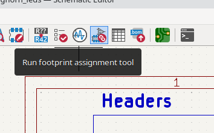
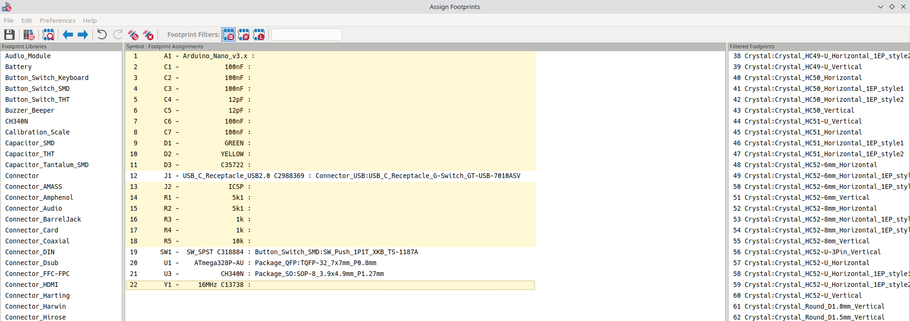
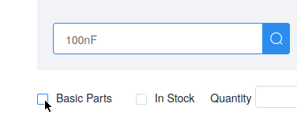
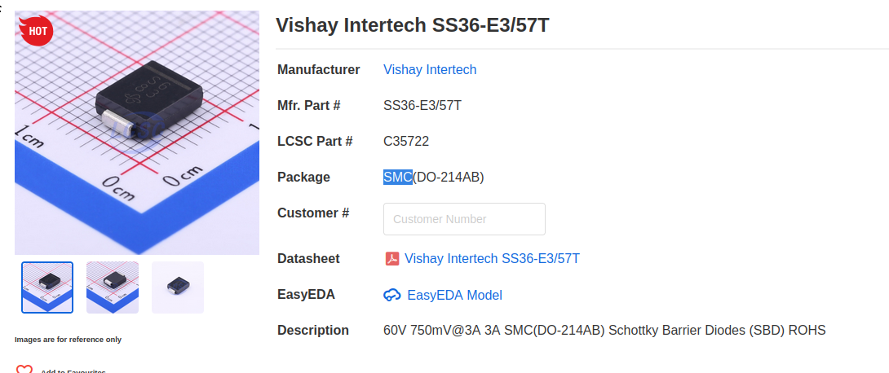
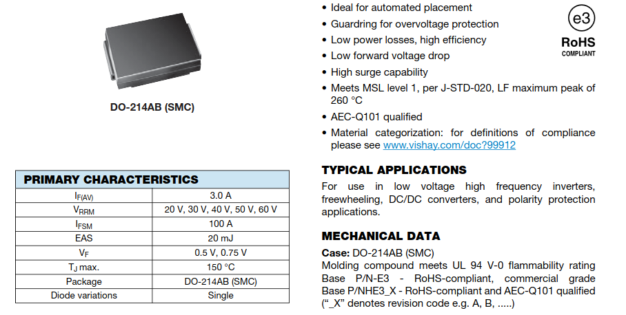
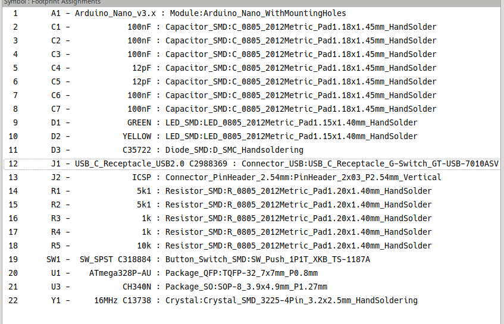
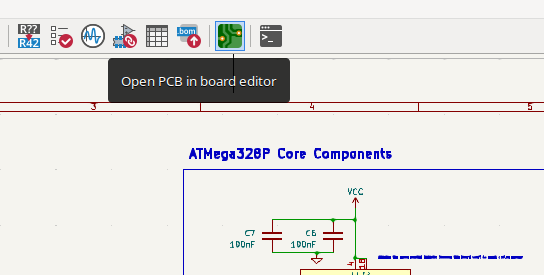
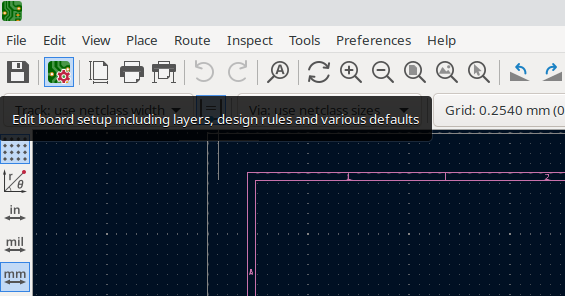
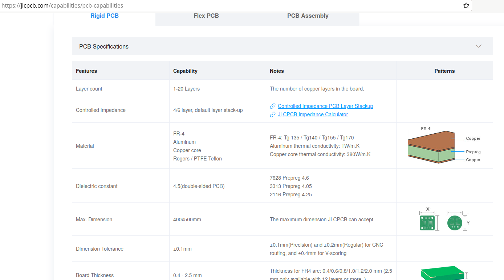

KiCAD version, maybe make an EasyEDA section later? I don't want to manually transfer my whole schematic and auto thing is not working.

In this workshop we will turn our schematic from Part 1 into an actual PCB.

Prerequisites

The rest of the workshop assumes you understand PCB Basics like:
1. Layers: describe 
2. Traces: describe

## Footprint assignment

Footprints are the exposed copper pads on the PCB for each component.

First, click on run footprint assignment tool.

In the new window, under Footprint Filters, select the first one - "filters defined in symbol" - but deselect the other two to get good filtering.

Now, you should have a window like this with some footprints autofilled, others empty.

Some footprints, like the Arduino Nano outline, which is not a real component in this case, only have a few options. Double click on `Module:Arduino_Nano_WithMountingHoles` to select it.

### Generics

0402, 0603, 0805, and 1206 are common sizes of small two terminal SMD components like resistors, capacitors, and diodes. 0805 is very common and still somewhat hand solderable, so we will use 0805 for all our components.

To find our first capacitor, go to <https://jlcpcb.com/parts>. In this case, we will search for 100nF, our first capacitor.

Then, select "Basic Parts" to find the parts that don't have the extended fee and we see that they do have 0805 available. So, we can select `Capacitor_SMD:C_0805_2012Metric_Pad1.18x1.45mm_HandSolder` for all our 100nF capacitors in KiCAD. You can similarly go through each capacitor and resistor value on JLCPCB Parts and find that they have 0805 versions available. So, all capacitors will be `Capacitor_SMD:C_0805_2012Metric_Pad1.18x1.45mm_HandSolder`, all LEDs will be `LED_SMD:LED_0805_2012Metric_Pad1.15x1.40mm_HandSolder`, and all resistors will be `Resistor_SMD:R_0805_2012Metric_Pad1.20x1.40mm_HandSolder`.

### Specific Components

If you look up the Diode `C35722`, you will get its LCSC page, which says the package is `SMC(DO-214AB)`.

Going to the Datasheet also confirms this.

Then, in KiCAD, after selecting the diode, we can search for the package. While there are no results for DO-214, SMC shows up and we can select `Diode_SMD:D_SMC_Handsoldering`.

Doing the same with the Crystal will get you its package `SMD3225`, and footprint `Crystal:Crystal_SMD_3225-4Pin_3.2x2.5mm_HandSoldering`.

Similarly, for the ICSP header, you will get the right result by searching for 2.54mm (i.e. 0.1 inch pin spacing), and 2x03 (6 pins arranged in 2x3): `Connector_PinHeader_2.54mm:PinHeader_2x03_P2.54mm_Vertical`.

### Other components

You might've noticed that in my original footprint assignment window had some components filled out already. This is because chips like the ATmega328P-AU only have one footprint - that's what the `AU` designates.

Others, like the switch, were found by searching for the part number `1187A` through the footprint window.

Lastly, some components like the USB-C Receptacle can be weird. While there are hundereds of different manufacturers of USB-C ports and receptacles, there are only a few common designs. However, there is no way to confirm which part uses which design, so in this case, I went backwards - first picking the KiCAD footprint that I liked, and then finding that part of JLCPCB, which happens to be the `7010ASV`.

---

Now that our footprints are all selected, we can move on to the PCB!

## PCB

## Further Reading
1. https://eepower.com/resistor-guide/resistor-standards-and-codes/resistor-sizes-and-packages/#