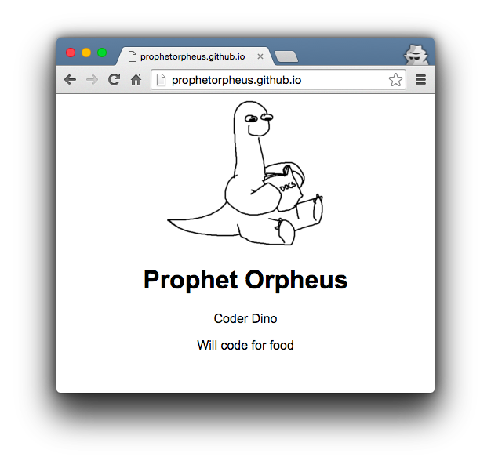
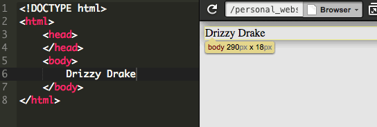
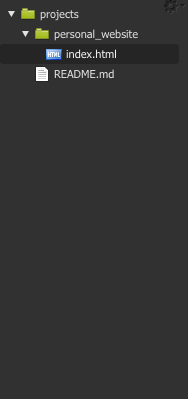

# Personal Website

By the end of this workshop, you will learn to make your own personal website.
It will look something like this:



Open the [live demo][final_live_demo]. See the [final code][final_code].

[final_live_demo]: https://cdn.rawgit.com/anonymous/7a5a6cc614052c8c810f/raw/9419c5a5a4a871da091a49844ffbc46f434c01c8/index.html
[final_code]: http://jsbin.com/gist/7a5a6cc614052c8c810f?html,output

**On the way, you will:**

- Begin to learn the programming languages **HTML** & **CSS**
- Setup the coding tools **GitHub**, **Cloud9**, **Slack**, which you will use
  throughout your time in Hack Club

## Part I: Setup

### 1) Sign Up for GitHub

GitHub is a website used by millions of programmers to collaborate on code.
Think Dropbox, but for code. We'll be using it to store and manage our code in
Hack Club.

1. Open https://github.com/join in a new tab and create a new account
  - Choose a username you will be proud to show future employers. (ex.
    `zachlatta` and `jonleung`)
  - Use an email that you have access to, you'll need to access it
    to verify your account
  - Make sure to remember your username and password, you'll need this at every
    club meeting
  - When prompted to choose a plan, to choose the **"Free"** plan
2. Open your email inbox in a new tab and look for an email from GitHub. Open it
   and click the button to verify your email
3. Open https://gh.hackclub.io in a new tab and star the project by clicking on
   the button that looks like this on the top right: 

### 2) Create Your First GitHub Repository

GitHub allows us to **host** our website using a service called **GitHub
Pages**. This means that we can put the files of your website
on GitHub and GitHub will give you a URL that you can share with the world.

1. Go to https://github.com
2. Click the green **"+ New repository"** button
3. Under **"Repository name"** write your `USERNAME.github.io` except instead of
   writing `USERNAME`, write your actual GitHub username. So if your username
   is `alice1337`, then you would write `alice1337.github.io`. You **have** to
   name your repository this in order for the GitHub Pages functionality to work
   correctly (more on what this is later).
4. Make sure that you did the previous step correctly.
  - Is your **username** entered correctly
  - The repository name should end in **`.io`**
5. After you are sure you entered in the repository name correctly, click the
   green "Create repository" button at the bottom.
6. Then copy the **"HTTPS link"** at the top. It should look like this:
   `https://github.com/username/username.github.io.git`. You will need this link
   for the next step.

### 3) Sign Up for Cloud9

Just like you can use Google Drive to write and organize documents written in
English, we'll be using **Cloud9** to write, save, and organize our code.

> The techy term for a place where you can write, and organize code is **"IDE"**
> or "Integrated Development Environment"**

1. In a new tab, open https://c9.io/
2. In the top right hand corner, click the button that looks like this:
   
3. Click the green **"Authorize application"** button
4. If there is a popup that asks for your email, go ahead and enter it
5. Click the gray box that says **"Create a new workspace"**
6. Set the **"Workspace name"**, to `projects`
   is your GitHub username.
7. Under **"Clone from Git or Mercurial URL"**, paste the **HTTPS Link** that
   you copied your GitHub repository.

   > 

8. Then without changing anything else on the screen, scroll to the bottom and
   click the green **"Create Workspace"** button.

You should now see a screen looks something like this:


> Note:
>
> If you're waiting for a while (more than 10 seconds) and the above screen
> still doesn't load, try the following:
>
> 1. Open https://c9.io
> 2. Click on the green **"Open"** button**
> 3. You should now see screen shown above. If not, ask your facilitator for
>    help

### 3) Celebrate!

> 

Congratulations, you've officially set up all of your coding tools for the
semester!

Now we're ready to start the website!

## Part II: Create the Project Folder

We're going to create a new folder for each project in Hack Club.

Let's create a folder for our personal website project:

1. On the left side of the screen, right click the **`projects`** folder
2. Click **"New Folder"**
3. Then name the folder **`personal_website`**

> 

## Part III: HTML

Every website is written with **HTML** code. HTML code is written in **HTML
files**.

> HTML stands for Hypertext Markup Language.

### 1) Create the HTML file for your website

1. Right click the **`personal_website`** folder you just created
2. Click **"New File"**
3. Then name the file **`index.html`**
4. Double click it to open it

> 

> Notes:
>
> - Just like Microsoft Word Documents end in **`.doc`**, HTML files end in
**`.html`**
> - Your main HTML file has to be named **`index.html`**

### 2) Adding standard HTML template

Every HTML file follows this template:

```html
<!DOCTYPE html>
<html>
    <head>
    </head>
    <body>
    </body>
</html>
```

Let's put this template inside of our HTML file:

1. Double click the **`index.html`** file you just created to open it
2. Retype the above HTML code into your **`index.html`** file, like so:

> 

### 3) Adding to the Template

There's a lot going on in the below template. For now, let's just understand
that there are two sections in this template, the **`head`** and the **`body`**:

```markdown
<!DOCTYPE html>   
<html>          
    <head>
            ← "this section is called the **`head`** of the **`html document`**"
    </head>
    <body>
            ← "this section is called the **`body`** of the **`html document`**"
    </body>
</html>
```

- The **`body`** of the HTML document is where all the **content** belongs. This
  includes all of the words and images on the page.
- The **`head`** of the HTML document is where you set the settings for the page
  and include other code files you want on your website.

### 4) Opening the Website Preview

Let's see what our website looks like so far:

1. First, save the file by clicking **"File"** _(on the top right)_ → **"Save"**
   (or use the shortcut **CTRL + S / Command + S**)
2. Preview what the website looks like by clicking **"Preview"** → **"Live
   Preview File"**

> 

As you can see, page is still blank. This is because we haven't added any
**content** in the **`body`** section yet. Let's add some!

### 5) Adding My Name to the Body of the HTML

1. Write your name in the **body** of the HTML page (between the **`<body>`**
   and **`</body>`**). My name is `Drizzy Drake` so that's what I will write.

> 

Notice that that the HTML code you write is immediately updated in the preview.
That's why it's called a **"Live Preview"**

### 6) Adding a Description

1. Underneath on a new line, write one short sentence about yourself. I love my
   job as a call center representative so I'm going to write `MVP hotline
   answerer`.

> 

Notice that the blank line between my name and description isn't reflected on
the web page. Adding blank lines or spaces between your words
in HTML does will not change what your website looks like.

To add spacing and other formatting, we need to use **HTML tags**.

### 7) Formatting the Heading with the Heading Tag

If I want `Drizzy Drake` to be a heading of my webpage, I can put it inside of
what's called a **heading tag**, like so:

```html
<h1>Drizzy Drake</h1>
```

**HTML tags**, like this heading tag, tell the computer how to interpret the
text in between the tags.

1. Make your name look like a heading by surrounding your name with an `h1`
   tag.

    > Note: In Cloud9, as soon as you write  **`<h1>`**, it knows you will
    > eventually want a **`<h1>`**, it just adds it for you. This is known
    > as **autocomplete**.


> 

There are two parts to the `h1` tag:

- **`<h1>`** is the **opening**  tag
- **`</h1>`** is the  **closing** h1 tag. The difference is
  the **`/`** before the tag's name

Because the browser knows to interpret anything inside of an **`h1`** tag as a
heading, it makes your name big and bold.

### 5) Formatting the Description with a Paragraph Tag

Similarly to how we told the browser to treat **`Drizzy Drake`** as a header, I
want to tell the browser to treat **`MVP hotline answerer.`** as a paragraph.

1. Put your description inside of a **paragraph tag** like so:

```html
<p>MVP hotline answerer</p>
```

> 

Just like **`h1`** tag, the **`p`** tag also has an opening and closing tag.

### 6) Adding an Image with the Image Tag

Now let's add an image to our website.

Instead of adding a picture of yourself right now, let's just use this picture
of me for now and you can change it later:


Here's the URL for the image

```
https://surrogate.hackedu.us/i.imgur.com/S06cY9j.gif
```

To add the above image to the top of the page

1. Insert this code for **image tag** just underneath of the **opening `body`
   tag**

  ```html
  
  ```

> 

> - **`img`** is the tag name
> - **`img`** is a **self closing tag**, meaning that there is no
>   closing tag (like **`</img>`**)
> - **`src`** is an  **attribute** of the image tag that specifies the URL of
    the image

Hmm, our image is too big. Luckily we have this other language called **CSS**
that can help!

## Part IV: CSS

**HTML** is the **content** of a page (words, images, and structure).

**CSS** is the look and feel (**color**, **spacing**, and
  **size**).

> **CSS** stands for **Cascading Style Sheet** and is sometimes referred to just
> as a **style sheet** because it's a **"sheet"**, the specifies all of your
> **"styles"**.

Therefore, if we want to change the **size** of the image, we use **CSS**!

### 1) Creating the CSS file

1. Right click the **`personal_website`** folder you had previously created
2. Click **"New File"**
3. Then name the file **`styles.css`**

> Note:
>
> - The **`.css` extension** tells the computer to interpret this as a `css`
>   file (just like `.doc` and `.html`)

> 

### 2) Connecting the CSS to the HTML

Although we've created a CSS file, until we explicitly tell the HTML file to use
the CSS file, it will not use it. We have to explicitly **link** the CSS file in
the HTML.

To **link** the CSS file:

1. Type the code for the **link tag** (written below), into the **`head`**
   section of the code.

   ```html
   <link rel="stylesheet" href="styles.css">
   ```

> 

> Notes:
>
> - **`link`** is the tag name
> - **`link`** tags always belong in the **`head`** of the HTML document
> - **`link`** is a **self closing tag** like **`img`**
> - **`href`** is an  **attribute** of the link tag and specifies the location
>   of the CSS file. It stands for **hypertext reference**.
> - **`rel`** is an **attribute** that tells the browser to interpret the
    linked file as a **stylesheet**

### 3) Using CSS to Resize the Image

Now that we linked our CSS file to our HTML file, let's write some CSS to make
the image smaller:

1. Double click **`styles.css`** to open it
2. Then add the below CSS code to make the image smaller by typing the
   following code into the CSS file.

    ```css
    img {
        width: 200px;
    }
    ```
3. Then to save your changes, click **"File"** → **"Save"** (or use the shortcut
   **CTRL + S / Command + S**)

Yay! Our image got smaller!

> 

**Understanding The CSS More Deeply**

If we were to translate the code into English, this

```css
img {
    width: 200px;
}
```

 would say

- **Select** every **`img` tag** on this HTML page and set the **width** to be
  **`200px`**

> **`px`** stands for **pixels**. **Pixels** are the tiny dots that make up a
> computer screen. By setting the width to **200px**, we are saying we want
> every image on the page to span the length of 200 pixels (which is about 2
> inches on a screen). If you want to learn more about pixels, you can Google
> ["What is a pixel?"](https://www.google.com/#q=what+is+a+pixel)

### 4) Centering the Body

Then to center everything on the page

1. Type the below CSS code underneath our previous CSS code. _Remember, don't
   copy and paste._

   ```css
   body {
       text-align: center;
   }
   ```
3. Save the file by clicking **"File"** → **"Save"** (or use the shortcut
   **CTRL + S / Command + S**)

> 

Now everything should be centered on the page.

#### Understanding More Deeply

If we were to translate the code into English, this

```css
body {
    text-align: center;
}
```

would say:

- **Select** every **`body` tag** on this HTML page and set the **alignment** of
  the **text** within the body tag to be **centered**

This centers everything on our page because all of the content in our HTML file
is written inside the body tag.

And because everything is in the **body** tag, everything is centered.

> You can Google ["CSS text align"]
> (https://www.google.com/?gws_rd=ssl#q=css+text+align) to see what other
> alignment options are available besides **`center`**

### 5) Changing the Font

Finally let's change the font of the page to **`Arial`**.

Add another **CSS attribute** to the **`body` selector** so that your CSS code
for your **`body`** looks like this:

  ```css
  body {
      text-align: center;
      font-family: Arial;
  }
  ```

> 

> Not all computers have the same fonts on them. To figure out what fonts most
> computers have on them, you can Google
> ["web safe fonts"](https://www.google.com/#q=web+safe+fonts)

### 6) Celebrate!


W0000t! You've successfully added the CSS to this web page!

Now to share your creation with the world.

## Part V: Deployment

Right now we can only see our website on our own computer. Let's get a link that
we can share with anyone on the internet!

### 1) Hosting on Cloud9

In the **live preview** of the website:

1. Click the button that looks like this

   > 

2. Then in the new window that pops up, copy the URL of the address bar
3. You can send this URL to anyone else in the world and they will be
   able to view your website!

**But there's a problem:**

This URL won't work indefinitely, it will stop working when you don't use your
Cloud9 for a couple of days. We want something that other people will be able to
open even if it's a year from now.

We can use **GitHub Pages** to **host** our website instead!

#### 2) Pushing to GitHub Pages

Instead we can send our updates to GitHub.

1. Open the terminal by pressing `alt + t` on the keyboard at the same time.
   Then type in the following commands:
  - `git add --all`
  - `git commit -am "Initial commit"`
  - `git push -u origin master`

4. GitHub will now ask you for your username and password.
  - Go ahead and enter your username and then press the enter.
  - Then enter your password and press enter. _Note that the characters don't
    show up on the screen but rest assured, you are still typing._
5. Now try to view your website by going to
   `USERNAME.github.io/personal_website`. So if your username is `alice1337`,
   then you would write `alice1337.github.io/personal_website`.

   > Make sure to change `username` to your own username

#### 3) Celebrate!


Yes! Your website is now public on the internet and will stay! Feel free to
share this with your friends!

## Part VI: Sharing with the Community

Now that you have finished building your website

1. In a new tab, open and follow [these directions][slack] to signup for our
   Slack
2. Join your club's channel by asking your club leader for the name of the
   channel
3. Post the link to your website
  - In your club's channel
4. Post it in the [Ship It](https://shipit.hackclub.io) gallery!

[slack]: ../../SLACK.md

## Part VII: Hacking

Until now, you've been following a decently rigid tutorial. Now is your chance
to to take your website and make it your own.

1. Below are some websites from other Hack Clubs from around the world to give
   you some inspiration! Check out at least one of them.
2. Add to and customize the website we make together to make it your own!

### Examples

#### Websites Made by Other Hack Club Hackers

- [Gaudy Salas](https://output.jsbin.com/zilola)
- [Alyssa Sun](http://output.jsbin.com/fopoxe)
- [Rebecca Jourard](https://mnefertiti.github.io/personalwhale/)
- [John Cena's](http://nguyenbrian.github.io/john-cenas-personal-website/)
  (created by, Brian Nguyen)
- [Jevin Sidhu](http://jevinsidhu.com/)
- [Harrison Shoebridge](https://harrison.tech/zero-cool/)
- [Chaoyi Zha](https://cydrobolt.com/)

#### Professional Websites

- [Alice Lee](http://byalicelee.com)
- [Yaron Schoen](http://yaronschoen.com)
- [Pushkar Modi](http://pushkarmodi.com)
- [Roxanne Ravago](http://www.roxanneravago.com)

### Additional Resources

Here are some additional resources that you can use to learn more about HTML &
CSS.

| Resource                                                                | Pros                                                                                     | Cons                                                                            |
|-----------------------------------------------------------------------------------|------------------------------------------------------------------------------------------|---------------------------------------------------------------------------------|
| [HTML Dog](http://www.htmldog.com/guides/html/beginner/)                | Very beginner focused. If you're not sure which one of these to choose, choose this one. | Isn't too rich in content.                                                      |
| [Free Code Camp](http://www.freecodecamp.com/map)                       | Interactive and very methodical.                                                         | Not made for you to learn to make something that you want to show your friends. |
| [Team Tree House](https://teamtreehouse.com/library/html/introduction/) | Their videos are extremely comprehensive an thorough                                     | It takes a _very_ long time to get through and are very passive.                |
