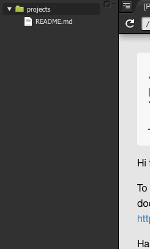
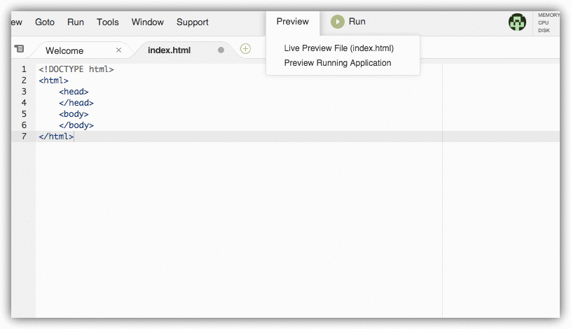
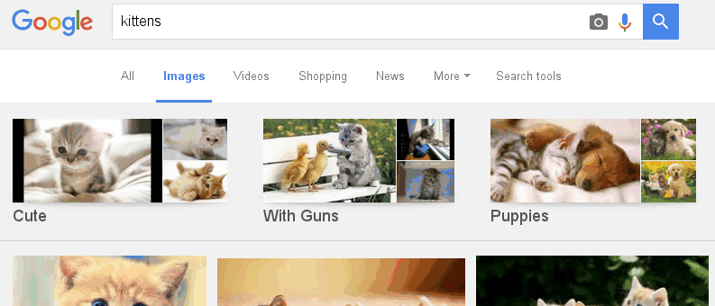
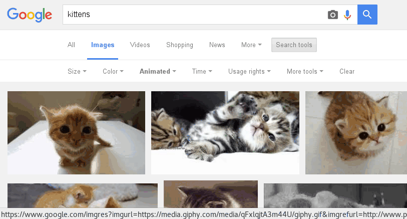

# Make A Personal Website

This workshop shows you how to make your own website.

[][live_demo_image]

_Here's a link to the [real thing][final_live_demo] and [code][final_code]._

[live_demo_image]: https://cdn.rawgit.com/anonymous/7a5a6cc614052c8c810f/raw/9419c5a5a4a871da091a49844ffbc46f434c01c8/index.html "But with whatever your name is instead of Drake"
[final_live_demo]: https://cdn.rawgit.com/anonymous/7a5a6cc614052c8c810f/raw/9419c5a5a4a871da091a49844ffbc46f434c01c8/index.html
[final_code]: http://jsbin.com/gist/7a5a6cc614052c8c810f?html,output

**Table of contents:**

- [Setup](#setup)
- [Create The Project Folder](#create-the-project-folder)
- [Making The Site](#making-the-site)
- [Making The Site Look Nice](#making-the-site-look-nice)
- [Publishing](#publishing)
- [Sharing with the Community](#sharing-with-the-community)

## Setup

### Sign Up for GitHub

GitHub is a website used by millions of programmers to collaborate on code.
We'll be using it for everything we make in Hack Club.

1. Open https://github.com/join in a new tab and create a new account
  - Use an email that you have access to (you'll need to verify your account).
2. Verify your account through the email GitHub sends.
3. Open https://gh.hackclub.com in a new tab and star the project by clicking
   the button that looks like this on the top right:

   

### Create a Repository

A repository (repo for short) is a place to store code. GitHub will store our
repos for free.

1. Go to https://github.com and create a new repository

   

2. Under **"Repository name"** write `USERNAME.github.io` except instead of
   writing `USERNAME`, write your actual GitHub username.
3. Click the green "Create repository" button at the bottom.
4. Copy the page URL. You'll use this link in the next step.

### Sign Up for Cloud9

**Cloud9** lets us write, save, and organize our code. We'll be using Cloud9 to
write all of our code in Hack Club.

1. Head to https://c9.io/ and sign up for Cloud9 through your GitHub account by
   clicking on the GitHub icon in the top right corner:

   

2. Click the gray box that says **"Create a new workspace"**.
3. Set the **"Workspace name"** to `projects`.
4. Make sure your workshop is set to **"Public"**.
5. Under **"Clone from Git or Mercurial URL"**, paste the **HTTPS Link** that
   you copied from your GitHub repository.

   

6. Make sure that you're using the **"Custom"** template.
7. Click the green **"Create Workspace"** button. You should now be at a screen
   that looks like:

   

_If you're waiting for a while (more than 10 seconds) and the above screen still
doesn't load, try refreshing._

### Celebrate!


Congratulations, you've officially set up all of your coding tools for the
semester!

Now we're ready to start the website!

## Create the Project Folder

We'll put each project built in Hack Club in a separate folder in Cloud9.

To start, let's create a folder for our personal website:

1. On the left side of the screen, right click the `projects` folder.
2. Click **"New Folder"**.
3. Name the folder `personal_website`.



## Making The Site

Create a new file in your `personal_website` folder called `index.html`.


### Adding Standard HTML Template

Every HTML file follows this template:

```html
<!DOCTYPE html>
<html>
    <head>
    </head>
    <body>
    </body>
</html>
```

Let's put this template inside of our HTML file:

1. Double click the `index.html` file you just created to open it.
2. Retype the above HTML code into your `index.html` file, like so:


### Adding to the Template

There's a lot going on in the below template. For now, let's just understand
that there are two sections in this template, the `head` and the `body`:

```html
<!DOCTYPE html>
<html>
    <head>
        <!-- this section is called the "head" of the HTML document -->
    </head>
    <body>
        <!-- this section is called the "body" of the HTML document -->
    </body>
</html>
```

- Everything between the `<body>` and `</body>` tags is called the **body** of
  the page. `<body>` is the opening tag and `</body>` is the closing tag.
  Together, the opening tag and the closing tag compromise the `body` element.

_Note: most HTML elements have an **opening tag** and a **closing tag**. You'll
want to get used to this pattern._

### Opening the Website Preview

Let's see what our website looks like so far:

1. First, save the file by clicking **"File" > "Save"** (or use the shortcut
   **CTRL + S / Command + S**).
2. Preview what the website looks like by clicking **"Preview" > "Live Preview
   File"**.



As you can see, the page is still blank. This is because we haven't added any
**content** in the `body` section yet. Let's add some!

### Adding Text with the Paragraph Tag

Now let's add some text to the website. Between the `<body>`body tags, add a
`<p>` tag with text:

```html
...
<body>
    <p>MVP hotline answerer</p>
</body>
...
```

### Adding a Heading with the Heading Tag

I can also make a **heading tag**, like so:

```html
<h1>Drizzy Drake</h1>
```

Make your name look like a heading by surrounding your name with an `h1` tag.

_In Cloud9, as soon as you write `<h1>`, it knows you will eventually want a
`<h1>`, it just adds it for you. This is known as **autocomplete**._


Similar to how `body` has both opening and closing tags, there are two parts to
the `h1` tag:

- `<h1>` is the **opening** tag
- `</h1>` is the **closing** tag. Again, the difference is the `/` before the
  tag's name

Because the browser knows to interpret anything inside of an `h1` tag as a
heading, it makes your name big and bold.

### Adding An Image with the Image Tag

Now let's add a GIF to our website.

1. Open https://images.google.com in a new tab.
2. Search for anything (ex. "kittens", "doge", "pepe").
3. Tell Google Images to only show GIFs (`Search tools > Type > Animated`).

   

4. Click on the image you'd like to use and once it loads, right click on it and
   select `Copy image address`.

   

5. Insert this code for **image tag** just underneath of the **opening `body`
   tag**. Replace `IMAGE_LINK` with the link you just copied (hit `Ctrl+v` to
   paste, or `Command+v` if you're on a Mac).

  ```html
  
  ```


`img` is the tag name - `img` is a **self closing tag**, meaning that there is
no closing tag (like `</img>`) - `src` is an **attribute** of the image tag that
specifies the URL of the image. It stands for "source".

Hmm, our image may be too big or too small. Luckily we have this other language
called **CSS** that can help!

## Making The Site Look Nice

**HTML** is the **content** of a page (**words**, **images**, and
**structure**).

**CSS** is the look and feel (**color**, **spacing**, and **size**).

**CSS** stands for **Cascading Style Sheet** and is sometimes referred to just
as a **style sheet** because it's a **"sheet"** that specifies all of your
**"styles"**.

Therefore, if we want to change the **size** of the image, we use **CSS**!

### Creating the CSS File

1. Right click the `personal_website` folder you had previously created.
2. Click **"New File"**.
3. Name the file `styles.css` (again, all lowercase).


### Connecting the CSS to the HTML

Now that we have a CSS file, we have to tell our index.html file to use it.

To **link** the CSS file from our `index.html`, we'll add

```html
<head>
    <link rel="stylesheet" href="styles.css">
</head>
<body>
...
</body>
```


### Using CSS to Resize the Image

Double click `styles.css` to open it and add the following:

```css
img {
    width: 200px;
}
```


If we were to translate the code into English, this would say:

> Select every `img` tag on the page and set the **width** to `200px`.

_`px` stands for **pixels**, a unit of size on your screen._

### Centering the Body

Now to center everything on the page:

```css
body {
    text-align: center;
}
```

If we were to translate the code into English, this would say:

> Select every `body` tag on this HTML page and set the **alignment** of the
> **text** within the body tag to be **centered**.

Because everything is in the **body** tag, everything is centered.

### Changing the Font

Add another **CSS attribute** to the `body` **selector** so that your CSS code
for your `body` looks like this:

```css
body {
    text-align: center;
    font-family: "Arial";
}
```


_Not all computers have the same fonts on them. To figure out what fonts most
computers have on them, you can Google search for
[web safe fonts](https://www.google.com/#q=web+safe+fonts)._

### Celebrate!


W0000t! You've successfully added the CSS to this web page!

Now to share your creation with the world.

## Publishing

Right now the website only exists in our workspace. Let's get a link that we can
share with anyone on the internet! GitHub will host our `USERNAME.github.io` on
**GitHub Pages** and give us a link to share it with the world.

1. Open the terminal by pressing `alt + t` on the keyboard at the same time.
   Type in the following commands, pressing enter between each one:
  - `git add --all`
  - `git commit -m "Initial commit"`
  - `git push`
2. GitHub will now ask you for your username and password. _The characters of
  your password will be hidden when you type. Just keep typing._
3. Now view your website by going to `USERNAME.github.io/personal_website` (make
   sure to replace `USERNAME` with your actual GitHub username).

#### Celebrate!


Yes! Your website is now public on the internet!

## Sharing with the Community

Now that you have finished building your website

1. In a new tab, open and follow [these directions][slack] to signup for our
   Slack.
2. Join your club's channel by asking your club leader for the name of the
   channel.
3. Post the link to your website in your club's channel.
4. Then, post the link to the
   [`#shipit`](https://starthackclub.slack.com/messages/shipit) channel to share
   it with everyone!

[slack]: ../../SLACK.md

### Additional Resources

Here are some additional resources that you can use to learn more about HTML and
CSS.

| Resource                                                                | Pros                                                                                   | Cons                                                                            |
| ----------------------------------------------------------------------- | -------------------------------------------------------------------------------------- | ------------------------------------------------------------------------------- |
| [HTML Dog](http://www.htmldog.com/guides/html/beginner/)                | Very beginner focused. If you're not sure which one of these to choose, pick this one. | Isn't too rich in content.                                                      |
| [Free Code Camp](http://www.freecodecamp.com/map)                       | Interactive and very methodical.                                                       | Not made for you to learn to make something that you want to show your friends. |
| [Team Tree House](https://teamtreehouse.com/library/html/introduction/) | Their videos are extremely comprehensive and thorough.                                  | It takes a _very_ long time to get through and are very passive.                |
