# Pico-8 Action Game

## Why Pico?

I consider Pico to be _the best_ way to introduce newcomers to coding because of just how fun it is to code in it. Unlike traditional game engines, Pico manages to preserve a traditional coding feel while also streamlining the whole game development process: you still write legitimate Lua code and implement all game systems (like animation, physics, and scenes) yourself. This is good in the long run because that means that beginners get to actually code their games from scratch, rather than gluing together a bunch of pre-made elements. At the same time, however, Pico makes implementing graphics, tilemaps, and even music a breeze by including all of those tools into the same package. This means that there's no more need in learning multiple pieces of software and how to make them work together, as everything is already there: for example, displaying a sprite from a spritesheet is as simple as `spr(0)`!

## Setup

This workshop requires a copy of [Pico-8](https://www.lexaloffle.com/pico-8.php), which unfortunately costs \$15. The good news is that Pico is DRM-free, which means that one license can technically be shared with the whole club.

It is also strongly recommended that you download this wonderful cheatsheet:

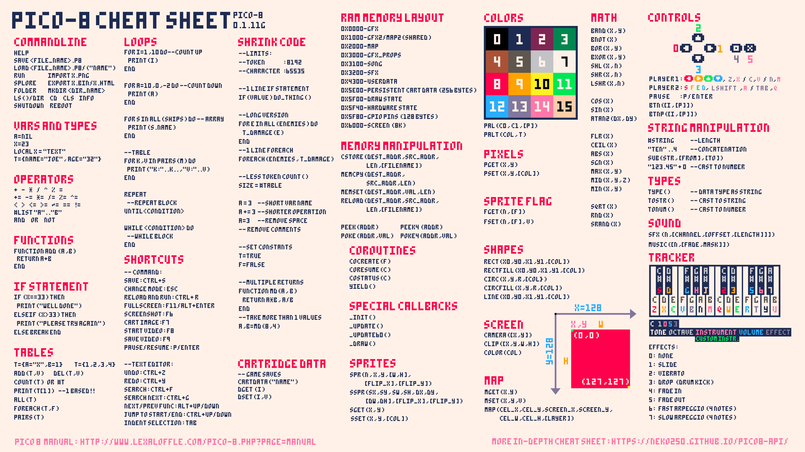

One common practice is to fullscreen it behind Pico, like so:

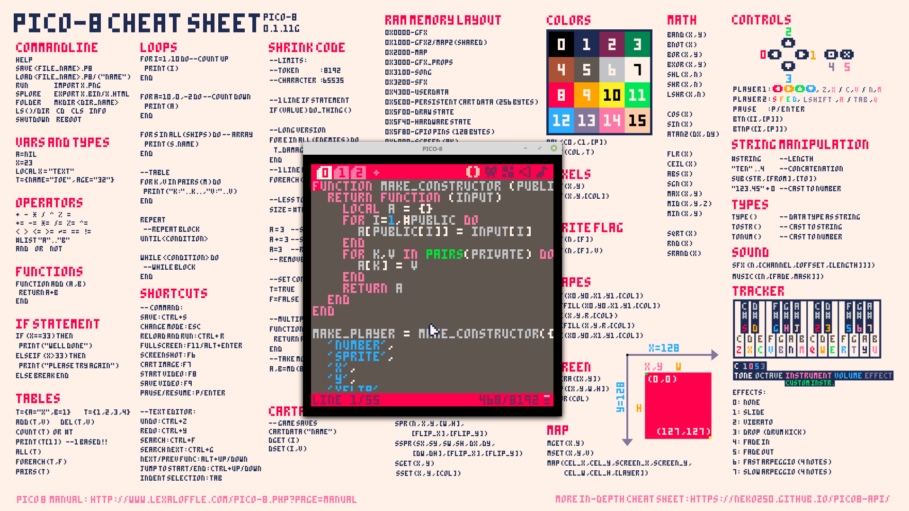

## Part 1: the early years

Tired of complex workflows and high-definition graphics? Well, the Pico-8 fantasy console is here to help. Through the course of this workshop you will make [this](demos/final.html) action game. Along the way you'll learn how to use the Pico console along with the basics of Lua scripting.

<iframe src="https://cdn.rawgit.com/hackclub/hackclub/master/workshops/pico_8/demos/final.html" width="100%" height="700px"></iframe>

A couple of basic pieces of information about Pico: there are three modes.

- The console mode

  

  This is what you see on startup, and allows you to run a couple of basic commands. Don't worry too much about it for now.

- The editor mode

  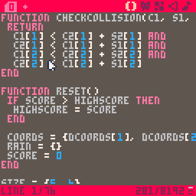

  This is where you make your game. The editor has multiple tabs that give you access to various bits of functionality. **You can get to it by pressing `Esc` from the console mode.**

- The game mode

  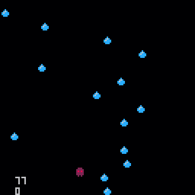

  This is where you can test your game. **You can get to it by pressing `Ctrl-R`. To get back to the editor, press `Esc` twice.**

### Sprites

Before we start coding we first need to take care of drawing the characters, or sprites, of our game. Go ahead and activate the editor mode and then click on the sprite editor tab. You can then use the various tools to draw a player and an object (like a rain drop) in 2 of the boxes. Feel free to play around with the various tools!

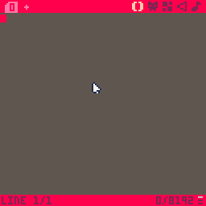

Note that you want your final sprites to be as close to the top left corner as possible, similar to how they're positioned in the GIF.

### Code, oh my

Before making the actual code, a bit of theory.


Every game has something called a game loop, which is code that is called every frame. This game loop is split into three parts: first, the game collects user input (is the right arrow pressed?). Then, the game updates some internal variables (move the player right). Finally, the game redraws the screen to reflect the new state.

In Pico, you can define that drawing phase by placing code in the following way:

```lua
function _draw()

 -- place code here!

end
```

Don't worry about what exactly is going on here, just understand that anything that goes in-between the `function` and `end` will be drawn onto the screen.

Side-note: in Pico, any line of code that begins with `--` is ignored, so it's useful for writing various comments about the code.

With that in mind, let's draw our player.

```lua
function _draw()

 spr(1, 0, 0)

end
```

`spr` is what is called a function: some code that can be run at any point. We can also pass information into functions, which is what we're doing in this example. Concretely, `spr` accepts 3 pieces of information (in this order):

- sprite number
- x coordinate of the top-left corner
- y coordinate of the top-left corner

`spr(1, 0, 0)` means to draw the second sprite in our spritesheet with its top left corner at `(0, 0)`. The reason that `1` points to the second sprite is because sprites are 0-indexed.

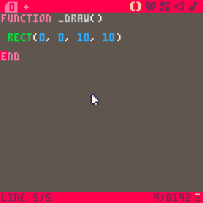

When you actually execute this (`Ctrl-R`), you may notice two things: that the square is in a weird place and that there's junk on the screen. In order to solve the screen issue, you need to clear the screen by adding a `cls()` to the top of your `_draw` function.

```lua
function _draw()

 cls() -- this clears the screen
 spr(1, 0, 0)

end
```

Now every frame will start from a blank screen.

The reason that the square is in the top-left corner is because coordinates actually work a little differently in Pico. As is drawn on the cheatsheet, the y-axis is actually flipped: this means that `(0, 0)` is actually the top-left corner. Remember this.

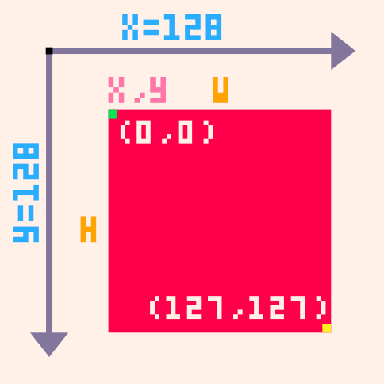

### Variables

Right now our "game" is a little boring, as the player isn't moving at all. The reason behind this is that we're always giving it the same coordinates. The solution? Variables.

Variables are essentially little boxes that allow you to store a value, like a number.

```lua
x = 3
```

Whenever Pico comes across a variable it replaces that variable with the value that is currently stored in it, so

```lua
x = 3
y = x -- y is now 3
```

turns into

```lua
x = 3
y = 3 -- y is now 3
```

Following the same principal, the following code will increment x by 1:

```lua
x = 3
x = x + 1 -- x is now 4
```

(turns into)

```lua
x = 3
x = 3 + 1 -- x is now 4
```

Let's add an `x` variable to our code.

```lua
x = 3

function _draw()
 cls()
 spr(1, x, 0)
end
```

Remember the game loop theory? Well, Pico provides another function for the update phase of the game-loop called `_update`. This function is run every loop before the `_draw` function, and so allows us to modify any variables we want. Let's modify the x variable so that the ghost moves to the right:

```lua
x = 0

function _update()
 x = x + 1 -- increment x by 1
end

function _draw()
 cls()
 spr(1, x, 0)
end
```

### Values

A value is anything that you can place into a variable. The most basic type is a number. As you saw earlier, there are also several operations that result in numbers:

```lua
3 + 3 -- 6, addition
3 - 3 -- 0, subtraction
3 * 3 -- 9, multiplication
3 / 3 -- 1, division
3 ^ 3 -- 27, to the power of
```

Whenever Pico comes across one of these operations, it replaces the operation with its result, so `3 + 3` becomes `6`.

The other important type is a boolean, which is just `true` or `false`. There are also operations that result in booleans:

```lua
4 == 4 -- true, equal to
4 ~= 4 -- false, not equal to

4 < 4 -- false, less than
4 <= 4 -- true, less than or equal to
4 > 4 -- false, greater than
4 >= 4 -- true, greater than or equal to

true and false -- false
true or false -- true
```

We can combine these to form complex logic expressions, like so:

```lua
4 != 4 or ((4 <= 5 or 3 != 3) and 3 <= 22) -- true
```

## User input

Before coding a solution to any problem, it's always way more useful to approach it from a high level. So here's a problem: how do we give the user the ability to control the player?

- Well, we need to make it so that the player only moves when the user presses certain buttons.
- We need to increment `x` when the user presses 'right' and decrement `x` when the user presses 'left'.
- We need to modify the `_update` function so that it check if 'right' or 'left' were pressed and modifies `x` accordingly.

But how do we run some code (modify the `x` variable) only sometimes? Welcome the `if` statement.

```lua
if true then
 print(1)
end
```

If the boolean between the `if` and `then` is `true` then the up to `end` is run. Otherwise, Pico just skips the whole expression.

We can get that boolean with the `btn` function, which returns `true` or `false` depending on whether a button is pressed.

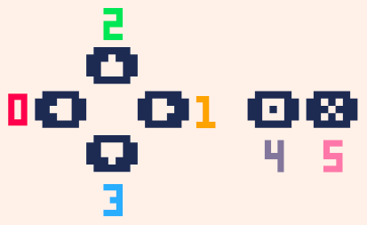

As shown on the cheatsheet, `btn` accepts a number (0-6) that denotes a keyboard button. Knowing that, try to write an implementation. Once you're done you can check your solution against ours:

```lua
function _update()
 if btn(1) then
  x = x + 1
 end
end
```

Now, every frame, Pico checks if the right button is pressed, and if so increases the x. Here is the complete code with the other direction added:

```lua
x = 0
y = 0

function _update()
 if btn(1) then -- right
  x = x + 1
 elseif btn(0) then -- left
  x = x - 1
 end
end

function _draw()
 cls()
 spr(1, x, y)
end
```

The code under `elseif` will only run if the first `if` statement is `false` - this makes it useful for grouping multiple conditions that you know can't all be true (e.g. you know that the player can't be moving right and left at the same time). If we had just made another `if` for moving left, then pressing down both right and left would have caused the player to stand still.

Notice that `elseif` doesn't require a separate `end`, and is sort-of grouped with the `if`. There is one last type of `if` and that is `else` - `else` is only evaluated if the previous `if`s and `elseif`s were all `false`. Here is an example to sum this up:

```lua
if false then
 -- this is not run
elseif false then
 -- this is not run
elseif false then
 -- this is not run
else
 -- this is run
end
```

Each `if` block has to have exactly one `if` and then can also optionally have one `else` and any number of `elseif`s.

### Borders

It is often important to restrict the player's movement - and again, this is best approached from a conceptual level. We need to...

- Stop the user from going off-screen
- Check if the user is off-screen and bring them back
- Check if the user has gone off screen for every direction and if so set their appropriate coordinate to be the screen's edge

Once again, try to implement this yourself and then compare your solution with ours:

```lua
function _update()
 if x < 0 then
  x = 0
 end
 if x >= 127 then
  x = 127
 end
end
```

There is a problem with this code, however, which is that the player can actually go off-screen. The reason that this happens has to due with how coordinates in Pico work.


Because the coordinates refer to the left hand corner checking the bottom or right edge of the screen isn't actually going to work. Instead, what you need to do is to draw an imaginary line that equals the edge minus the square size and check that instead:

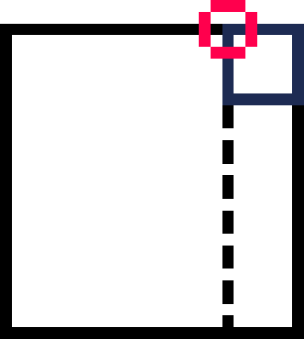

Here is the updated code:

```lua
width = 5 -- notice the new variables
height = 6 -- these are important so that it's easier to change the square size later on

function _update()
 if x < 0 then
  x = 0
 end
 if x >= 127 - width then
  x = 127 - width
 end
end
```

## Part 2: the invasion

The issue with our current game is that it's still pretty boring, so let's add some danger for the player: falling raindrops (or whatever object you chose). But the first issue that we'll encounter is that we currently don't have a good way to store multiple values. We could make multiple variables, like so:

```lua
raindrop1_x = 0
raindrop2_y = 0

raindrop1_x = 0
raindrop2_y = 0

raindrop1_x = 0
raindrop2_y = 0
```

but, as you can see, that takes up a lot of space and caps the amount of drops that we can create. In order to compactly store all of the drops we need a new value type: a table.

A table lets you store multiple values in one value (similar to a list or an array in other languages). While a regular variable can be thought of as a box, think of a table as a bag with a bunch of values in it. We can define a table like so:

```lua
t1 = {1, 2, 3}
t2 = {3, true, false, 32, 43}
t3 = {}
```

As you can see, a table can store any number of different value types. You create a table by putting them in curly brackets and separating them by commas. We can then access those variables by adding square brackets with the index of the value to the table name. Note that indices start at 1 in Lua.

```lua
t1[1] -- 1
t1[2] = 3
t1[3] = t1[3] + 1
```

You can think of this 'accessed table' as just another variable, and so you can do all of the standard variable things with it such as reading and writing its value.

Now we're faced by another decision: how do we store coordinates? If we apply tables to our current variable setup, this is what we would get:

```lua
rain_x = { 0, 3, 5, 6 }
rain_y = { 32, 43, 21, 32 }
```

But this is also sub-optimal because there is no way to guarantee that the two tables will always have the same amount of values, which could lead to bugs. The solution is to use a table of coordinate pairs:

```lua
rain_coords = { {0, 32}, {3, 43}, {5, 21}, {6, 32} }
```

This 'table of tables' approach improves our code by keeping all information in one place. But before we implement that, let's first change it so that we use the same approach in our code: that means replacing `x` and `y` with a single `coords` variable, and `width` and `height` with a `size` variable. Try that now.

```lua
function _update()
 if coords[1] < 0 then
  coords[1] = 0
 end
 if coords[1] >= 127 - size[1] then
  coords[1] = 127 - size[1]
 end
end
```

Notice how `x` is indexed by `1` because it is the first element in a coordinate pair, and `y` is indexed by `2` because it is the second element.

Now let's add the raindrops. For this we'll need to create a table of raindrops and use the `add` function to add a coordinate pair to this table every frame. `add` takes in a table and the value to add to its end.

```lua
rain = {}

function _update()
  add(rain, { 0, 0 }) -- adds a coordinate pair with an x of 0 and a y of 0
end
```

If you run the program now you'll notice that nothing appears - that's because we need to actually display the drops that we add. But if you think about it, we can't just magically display the whole table and install must call the `spr` function for every element in it. This is where the `for` loop comes in: it lets you execute a bit of code for every item in a list.

```lua
function _draw()
 -- for [variable name] in all([table name]) do
 for drop in all(rain) do
  spr(2, drop[1], drop[2])
 end
end
```

The for loop in this example goes through `drops` and for every value in that table sets `drop` equal to the value. Since in this case that value is a coordinate pair, we then use it to draw a raindrop sprite in that location. We call `spr` with `2` because our raindrop sprite has that value in our spritesheet.

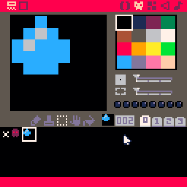

Here is what the code would do if drops were equal to `{{0, 0}, {0, 0}, {0, 0}}`:


```lua
drop = {0, 0}
spr(2, drop[1], drop[2])

drop = {0, 0}
spr(2, drop[1], drop[2])

drop = {0, 0}
spr(2, drop[1], drop[2])
```

### Let it rain

Moving raindrops requires a very similar technique to displaying them - this is because, again, we can't move an entire table and need to deal with its contents individually. Go ahead and write a loop in the `_update` function that moves all the drops downwards, and then compare your solution with ours:

```lua
rain_speed = 3

function _update()
 for drop in all(rain) do
  drop[2] = drop[2] + rain_speed
 end
end
```

It's worth setting the rain speed to a variable so that it's easier to change it later on. Unfortunately, our game still looks like this:

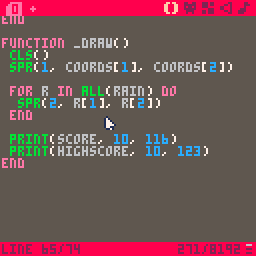

We can randomize the drops' starting x by using the `rnd` function, which returns a number from 0 up to but not including the number you give it.

```lua
rain_size = { 5, 5 }

function _update()
  -- add(rain, { 0, 0 }) turns into
  add(rain, { rnd(128 - rain_size[1]), -rain_size[2] })
end
```

The reason that we subtract `drop_size` from the width of the screen is for the same reason that we subtracted the player's width from the width of the screen when we were preventing them from going off - that helps us account for the fact that the coordinates actually refer to the top left corner of the droplet. If we allowed the droplet to spawn at 127 pixels then it would be almost entirely off-screen.

The reason we now spawn the droplets at a y of the negative droplet height rather than 0 is to give the illusion that the droplets are coming down from above the screen rather than spawning in it.

Another issue is that the droplets are spawning way too fast and we want a way to control that. The modulo operator (`%`) helps us out. It works by resulting in the remainder of dividing the two numbers it is called on.

```lua
10 % 7 -- 3
10 % 5 -- 0
105 % 10 -- 5
80 % 10 -- 0
```

This is useful because it can help us figure out if a number is a multiple of some other number: if `x` is indeed a multiple of `y` then `x % y` should equal `0`, because dividing them does not produce a remainder. We can use this concept to execute code periodically, for example every 10 frames.

```lua
frame = 0
rain_freq = 10
rain_size = { 5, 5 }

function _update()
  if frame % rain_freq == 0 then
    add(rain, { rnd(128 - rain_size[1]), 0 })
  end
  frame = frame + 1
end
```

Notice the new `frame` variable, which is important because it allows us to keep track of what the current frame is. As with rain speed, it is also a good idea to make rain frequency into a variable with `rain_freq`.

There is one final thing that we need to do with the rain. The problem is that currently the list of drops will grow infinitely large, which can cause considerable lag. The solution is to remove drops from it once they reach a certain point, such as the bottom edge of the screen. We can use the `del` function, which accepts a table and item to remove. Go ahead and try to use this to automatically remove drops from our `drops` table, and then check your solution:

```lua
function _update()
 for drop in all(rain) do
  drop[2] += rain_speed
  if drop[2] >= 128 then
    del(rain, drop)
  end
 end
end
```

### Collisions...

We're almost done with our game! Now we just need to add some challenge by 'poisoning' the rain. To make this happen, we need a way to know when a drop has collided with the player. This is a perfect application for a function. Remember that a function is just a bit of code that you can execute from any point in the program. You can also pass data in and out of the function, which is how we'll know whether the player collided or not. There's two steps to using functions: you need to 'define' it, and then 'call' it whenever you want to use it in your code. You call a function by adding `()` to its name, as we've been doing throughout this program. Here is how you define one:

```lua
function my_function(var1, var2)
  return true
end
```

`my_function`'s definition is very similar to how we defined `_draw` and `_update`, except for two things: it can accept arguments and always returns true. An argument is the data that you give the function by putting it in the function call. In order to better understand this, let's define a theoretical version of the `btn` function:

```lua
function btn(btn_number)
  return is_pressed_down(btn_number)
end
```

As you can see, parameters get assigned to variables inside of the function, so calling `btn(1)` sets `btn_number` equal to 1. This example also shows how you can pass data out of a function with the `return` statement.

Keeping all of this in mind, let's define the following collision function:

```lua
function collided(c1, s1, c2, s2)
 return
  c1[1] < c2[1] + s2[1] and
  c2[1] < c1[1] + s1[1] and
  c1[2] < c2[2] + s2[2] and
  c2[2] < c1[2] + s1[2]
end
```

For the time being don't worry about exactly how it works, but instead get familiar with how to use it. `collided` accepts 4 arguments: the coordinates on an object, the size of that object, the coordinates of another object, and the size of that other object. It then returns `true` or `false` depending on whether those two objects intersect. Here is how we would use it in our code:

```lua
function _update()
 for drop in all(rain) do
  drop[2] += rain_speed
  if drop[2] >= 128 then
    del(drops, drop)
  end

  if collided(
   drop, rain_size,
   coords, size
  ) then
    -- GAME OVER!
  end
 end
end
```

But how do we handle Game Over? well, in this case it would be useful to think about what internal variables we need to change in order to reset our game. Three immediately come to mind: the player's coordinates, the rain on the screen, and the frame number. You can just reset them inside of the collided `if` statement, but this seems like a good application for a function.

```lua
function reset()
 coords = {64, 110}
 rain = {}
 frame = 0
end

function _update()
 for drop in all(rain) do
  if collided(
   drop, rain_size,
   coords, size
  ) then
   reset()
  end
 end
end
```

Since the player's default position seems important, let's make that into a separate variable called `dcoords` (default coordinates). That way we can use it in other places when we initiate the player.

```lua
function reset()
 coords = { dcoords[1], dcoords[2] }
 rain = {}
 frame = 0
end

dcoords = {62, 105}
coords = { dcoords[1], dcoords[2] }
```

Now we can initiate/reset `coords` by just creating a table with the appropriate values of `dcoords`.

## Score

The last thing that our game is missing is a way to reward the player, and a great way is to keep a score. In our case we already have a score - the frame count - so all we have to do is implement a way to show and store it. Showing it is easy - Pico provides the `print` function, which accepts a value and an x and y. Don't forget to put this call in the `_draw` function, as it won't work anywhere else.

```lua
function _draw()
 print(frame, 10, 116)
end
```

Now try to add a variable that stores the high score and display that as well. Here is one solution:

```lua
highscore = 0
function reset()
 if frame > highscore then
  highscore = frame
 end
 coords = {0, 0}
 drops = {}
 frame = 0
end

function _draw()
 print(score, 10, 116)
 print(highscore, 10, 123)
end
```

In this code, every time that the game is reset Pico compares your current score with the high score. The high score is only updated if your current score is larger.

And...we're done! You can compare your final program with the one below:

```lua
function collided(c1, s1, c2, s2)
 return
  c1[1] < c2[1] + s2[1] and
  c2[1] < c1[1] + s1[1] and
  c1[2] < c2[2] + s2[2] and
  c2[2] < c1[2] + s1[2]
end

function reset()
 if frame > highscore then
  highscore = frame
 end

 coords = {dcoords[1], dcoords[2]}
 rain = {}
 frame = 0
end

dcoords = {62, 105}
coords = {dcoords[1], dcoords[2]}
size = {5, 6}
speed = 3

rain_size = {5, 5}
rain_speed = 3
rain_freq = 3

frame = 0
highscore = 0
rain = {}

function _update()
 if (frame % rain_freq == 0) then
  add(rain, {rnd(128 - rain_size[1]), -rain_size[2]})
 end

 for drop in all(rain) do
  drop[2] += rain_speed

  if drop[2] > 128 then
   del(rain, drop)
  elseif collided(
   drop, rain_size,
   coords, size
  ) then
   reset()
   break
  end
 end

 if btn(0) then
  coords[1] = coords[1] - speed
 elseif btn(1) then
  coords[1] = coords[1] + speed
 end

 if coords[1] < 0 then
  coords[1] = 0
 elseif coords[1] > 128 - size[1] then
  coords[1] = 128 - size[1]
 end

 frame = frame + 1
end

function _draw()
 cls()
 spr(1, coords[1], coords[2])

 for drop in all(rain) do
  spr(2, drop[1], drop[2])
 end

 print(frame, 5, 112)
 print(highscore, 5, 118)
end
```

## Next steps

It's your turn now! Going from "knowing" a language to actually being able to apply it is often the hardest part of programming, but hopefully this workshop gave you the tools and examples necessary to start creating your own code. At this point you can modify this game (maybe make it so that the player can move all around the screen) or maybe even make something from scratch. _As long as you use the cheatsheet and Google plenty of questions making an original game will seem like a breeze!_

Here are some topics that you may want to look in to:

- The map editor
- The SFX and music editors
- Strings and tables with string keys
- Metatables and object-oriented programming in Lua

Once you feel like you've achieved Pico-8 mastery, a very worthy game framework to look into is [Love2D](https://love2d.org/). Love is as simple and fun to use as Pico but provides much more freedom.
